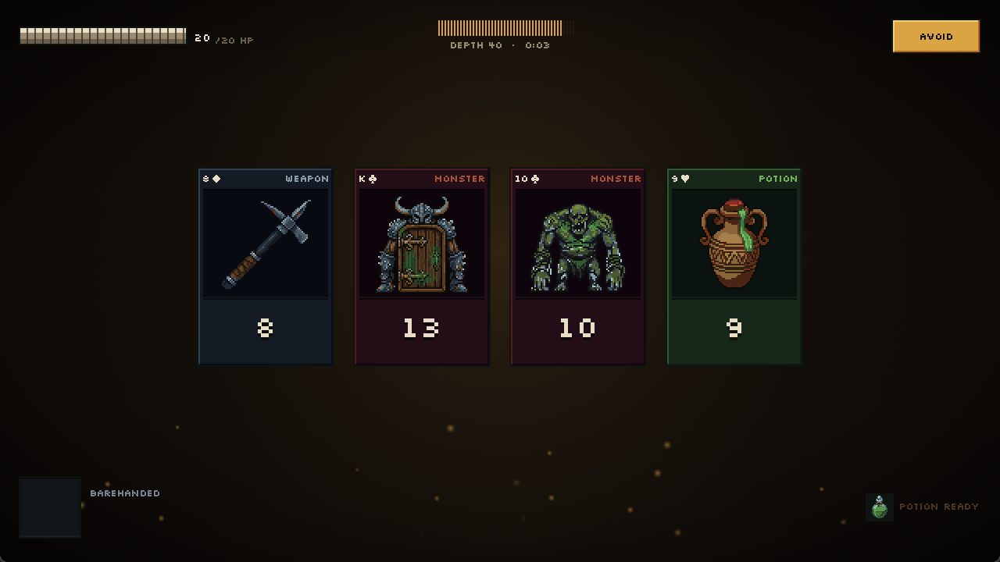
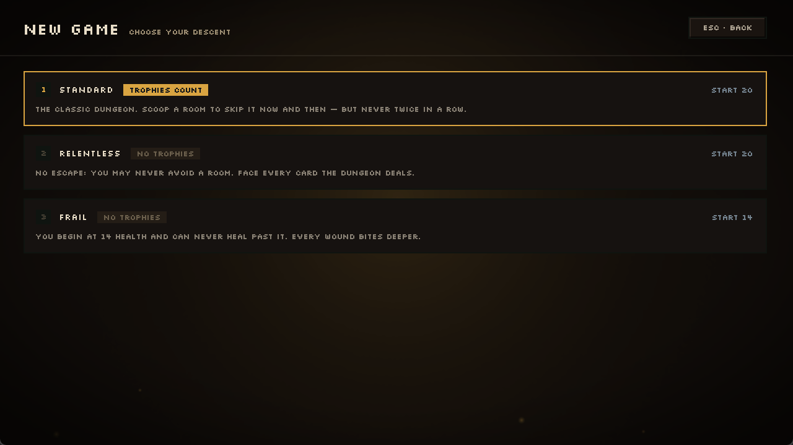
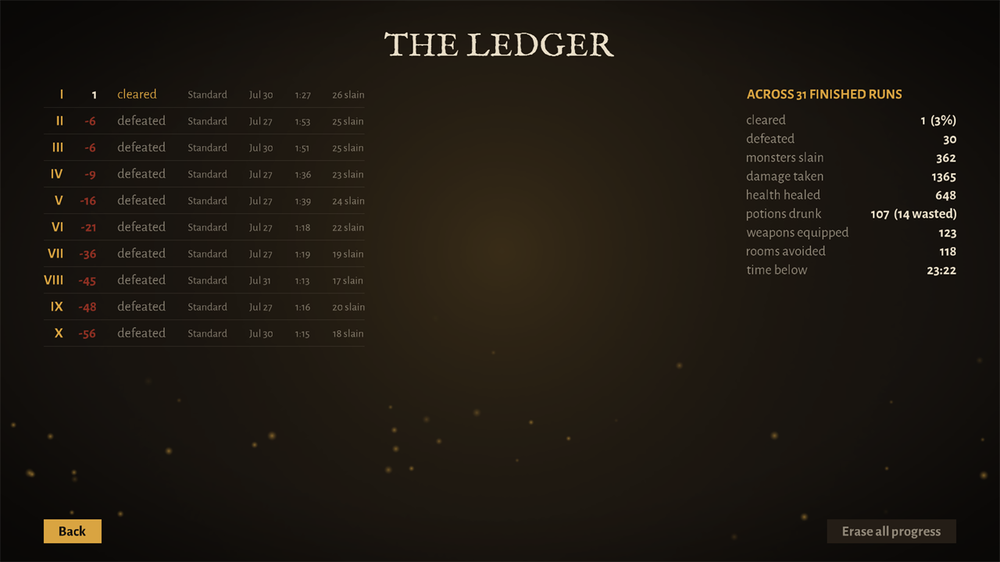
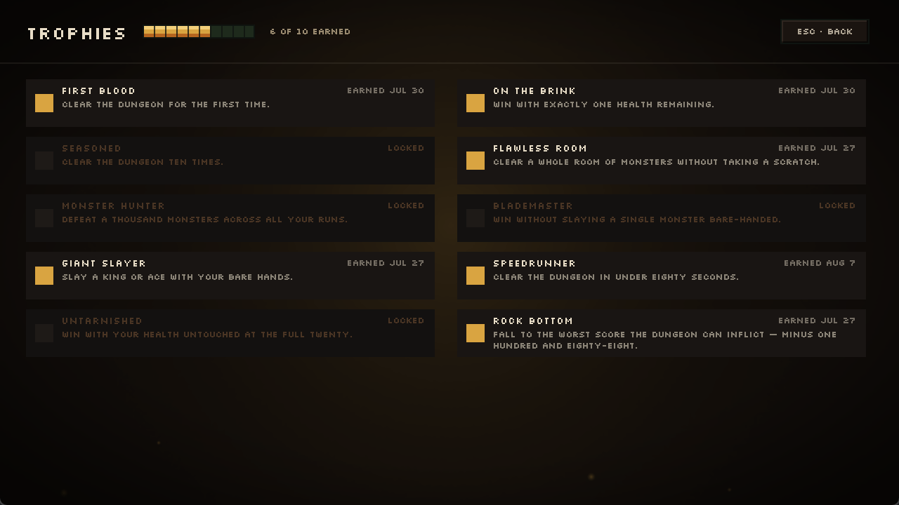
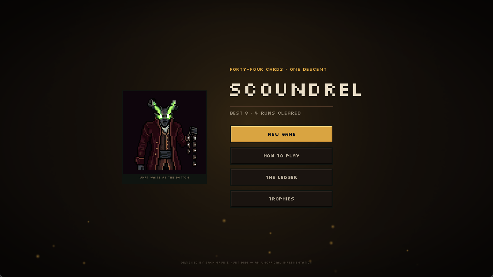

# Scoundrel

[](https://github.com/tomerba6/scoundrel-game/actions/workflows/ci.yml)
[](#testing)
[](LICENSE)
[](https://openjdk.org/projects/jdk/21/)
[](https://libgdx.com/)

A desktop implementation of **Scoundrel**, a single-player roguelike card game — built in Java
with libGDX, on a rules engine that is pure, headless and tested to 98.6%.

Scoundrel is a solitaire dungeon crawl played with a trimmed deck of 44 cards. You descend
through a dungeon of face-up cards, fighting monsters, swapping weapons and drinking potions,
trying to reach the bottom of the deck alive. It is quick, tense, and entirely about managing
risk with the hand the shuffle deals you.



## Features

- **The complete ruleset** — room dealing, avoiding, armed and bare-handed combat, weapon
  degradation, the one-potion-per-turn cap, and both scoring branches including the
  cap-plus-final-potion edge case.
- **Three difficulty modes** — Standard, Relentless and Frail, built as alternate rulesets rather
  than branches in the engine.
- **Guided tutorial** — a scripted first run that teaches every rule, offered once on first
  launch and replayable afterwards.
- **Persistent progression** — high scores and lifetime statistics across every finished run,
  ranked per difficulty, with ten achievements derived from the engine's event stream.
- **Animated presentation** — cards deal in and sweep away, per-card resolve effects, HP pulses,
  a death cinematic, and a procedural torchlit backdrop with live flicker and drifting embers.
- **Ships as a real application** — self-contained Windows and macOS builds that need no Java
  installed, borderless fullscreen with an F11 toggle, and crash reports written to disk.

## Play it

Download a self-contained build from the [latest release](https://github.com/tomerba6/scoundrel-game/releases/latest)
— each bundles its own trimmed JDK, so **no Java installation is required**.

| Platform | File |
|---|---|
| Windows (x64) | `Scoundrel-winX64.zip` |
| macOS (Apple Silicon) | `Scoundrel-macM1.zip` |

The builds are unsigned, so the first launch shows a warning: on Windows choose
**More info → Run anyway**; on macOS right-click the app and choose **Open**.

Or build from source — the Gradle wrapper is included, so you only need a JDK 21+:

```sh
./gradlew lwjgl3:run      # play
./gradlew core:test       # run the tests
./gradlew core:check      # tests + the coverage gate
```

On Windows use `gradlew.bat`. If the game ever crashes, the uncaught error is appended to
`~/.scoundrel/crash.log` (`%USERPROFILE%\.scoundrel\crash.log`) — useful to attach to a report.

## The game

The deck is 44 cards: the 26 clubs and spades are **monsters**, diamonds 2–10 are **weapons**,
hearts 2–10 are **potions**. You start at **20 health**, which is also the cap.

- **Rooms.** Cards are dealt four at a time. Resolve three of them; the fourth carries into the
  next room.
- **Avoiding.** Instead of fighting you may scoop the whole room to the bottom of the dungeon —
  but never two rooms in a row.
- **Combat.** Bare-handed you take the monster's full value. With a weapon you take
  `monster − weapon`, floored at zero.
- **Weapon degradation.** Once a weapon kills, it may only be used on monsters *strictly weaker*
  than its last kill. It stays equipped for weaker foes; anything equal or tougher must be fought
  bare-handed. This is the rule the whole game turns on.
- **Scoring.** Clear the dungeon and you score the health you kept. Die and you score a negative
  number: your health minus every monster still face-down in the dungeon — so dying early, with
  the deck still full, is far worse than dying on the last room.

Three difficulty modes ship: **Standard**, **Relentless** (avoiding is forbidden) and **Frail**
(14 health, and healing capped there).

<table>
  <tr>
    <td width="50%"></td>
    <td width="50%"></td>
  </tr>
  <tr>
    <td align="center"><em>Three rulesets, no engine changes</em></td>
    <td align="center"><em>Persisted high scores and lifetime totals</em></td>
  </tr>
  <tr>
    <td width="50%"></td>
    <td width="50%"></td>
  </tr>
  <tr>
    <td align="center"><em>Achievements derived from the engine's event stream</em></td>
    <td align="center"><em>Procedural torchlit backdrop</em></td>
  </tr>
</table>

## Tech stack

| | |
|---|---|
| **Language** | Java 21 (records, sealed types, pattern matching for `switch`) |
| **Framework** | [libGDX](https://libgdx.com/) 1.14 with the LWJGL3 desktop backend |
| **UI** | Immediate-mode pixel art over a `Pixmap`-generated backdrop; hand-drawn sprites packed into an atlas at build time. Scene2D remains on the last two overlays |
| **Build** | Gradle 9 multi-module, wrapper committed |
| **Testing** | JUnit 5, JaCoCo coverage gate |
| **CI/CD** | GitHub Actions — checks on every PR, tag-triggered release builds |
| **Packaging** | [construo](https://github.com/fourlastor-alexandria/construo) — self-contained archives with a trimmed JDK per platform |
| **Fonts** | IM Fell English and Alegreya Sans, rasterised at runtime via FreeType |

No third-party dependency does any game logic; the rules are entirely first-party code.

## Architecture

The problem worth solving here was keeping a *game* testable. Games tend to grow rules inside
render loops, where verifying them needs a GPU and a human watching — so the rules stop being
tested, and edge cases like weapon degradation quietly rot. The whole structure below exists to
avoid that: push every rule into code that a headless test can drive, and leave the graphics layer
with nothing to get wrong except drawing.

The organising constraint is a hard boundary: **the rules engine is pure Java with no libGDX
imports at all.** Not "mostly pure" — `model` and `rules` contain zero `com.badlogic.gdx.*`
references, so the entire game can be played to completion in a unit test with no window, no GL
context and no render loop. Everything else follows from that.

```
core/
  model/         cards, deck, game state — plain records, no behaviour beyond invariants
  rules/         moves, resolution, scoring — pure functions over state
  screens/       Scene2D views (libGDX-bound) — draw state, translate input into moves
  runs/          run recording, high scores, lifetime stats  ─┐ pure, and observe the
  achievements/  achievement definitions and evaluation       ├─ engine from outside;
  tutorial/      the scripted first run and its gating        ─┘ model/rules never
                                                                import any of them
lwjgl3/          desktop launcher, ~300 lines, no game logic
```

Four decisions carry most of the weight:

**Moves are functions of state.** `engine.apply(state, move)` returns a new state *and the events
that occurred* — monster slain, potion wasted, weapon broken, room avoided, game won. Nothing
mutates in place, so any position is reproducible and testable in isolation.

**Features observe the event stream from outside.** Achievements, statistics and high scores are
built entirely on those events. The `core` module has no idea they exist and never imports them,
which is why adding achievements required no engine changes at all.

**Rules live in an injected `Ruleset`.** Starting health, room size, cards resolved per turn, the
health cap, potions per turn, avoid rules, the scoring strategy and the deck are all configuration.
The three difficulty modes are *factory methods*, not new code paths — Relentless and Frail added
zero branches to the turn loop.

**Cards are data.** A card references a definition with an effect that applies itself to the state.
Resolving dispatches to that effect rather than switching on suit, so a new card type is a new
definition, not a new `case` in the engine.

The UI layer only draws state and turns input into moves. Where a screen grew logic that could be
tested — text formatting, hit regions, easing curves, resolve-effect selection — it was extracted
into a small pure class (`Motion`, `CardHitRegions`, `ClockText`, `FeedText`, `Labels`,
`ResolveEffect`, `TorchFlicker`, `Embers`) with a characterization test written *before* the move,
leaving the screens as thin views.

Full design notes, including the locked edge-case decisions and Mermaid diagrams, are in
[`docs/design.md`](docs/design.md); the UI layer is documented in [`docs/ui.md`](docs/ui.md).

## Testing

531 tests, written test-first for all pure logic. `./gradlew core:check` runs them and enforces a
JaCoCo gate of **90% line / 75% branch on every pure package** — the build fails below it.

| Package | Line | Branch |
|---|---|---|
| `model` | 100.0% | 100.0% |
| `rules` | 99.0% | 93.1% |
| `runs` | 98.7% | 96.3% |
| `achievements` | 98.3% | 97.5% |
| `tutorial` | 97.5% | 86.4% |

`screens` is deliberately **excluded** from the gate and sits near 8%. It is GL-bound — it needs a
window, a GPU and real pixels — so it is verified by driving the actual game and screenshotting it
instead. Gating it would enforce a meaningless number and reward writing tests that assert nothing.
The badge above therefore reports coverage of the *gated* packages, not the whole repository, which
is the figure the build actually holds itself to.

The engine's determinism is used deliberately: the tutorial's scripted run, for instance, is proven
by playing every one of its moves through the real engine in a test and asserting the narration's
promises against the actual scoring strategy — so the tutorial cannot silently start lying about
the rules.

## Development

```sh
./gradlew core:test        # 531 tests, headless, ~1s of execution
./gradlew core:check       # tests + the JaCoCo gate; HTML report at
                           #   core/build/reports/jacoco/test/html/
./gradlew lwjgl3:run       # play the current working tree
./gradlew lwjgl3:packageWinX64   # build a self-contained archive
```

Two conventions matter if you touch this code:

**Pure logic is written test-first.** The failing test comes before the implementation for
anything in `model`, `rules`, `runs`, `achievements` or `tutorial`. Those packages are headless by
construction, so there is never a reason not to.

**UI is verified by screenshot, not by test.** Rendering cannot be asserted meaningfully in JUnit,
so changes to `screens` are checked by launching the real game, driving it with synthesised input
and reading the pixels back. When a screen accumulates logic that *could* be tested — a formatter,
a hit region, an easing curve — that logic gets extracted into a pure class with a characterization
test written before the move, rather than left where it cannot be reached.

Design notes live in [`docs/design.md`](docs/design.md) and [`docs/ui.md`](docs/ui.md), and are
kept in sync with the code rather than written once.

## Roadmap

- [x] Pure model and rules engine — dealing, avoiding, combat, degradation, scoring
- [x] Scene2D UI, card motion, per-card resolve effects, death cinematic
- [x] Procedural torchlit atmosphere — glow, flicker, drifting embers
- [x] Persisted high scores, lifetime statistics, achievements
- [x] Three difficulty modes as alternate rulesets
- [x] Guided tutorial that teaches every rule, including scoring
- [x] CI, coverage gate, self-contained desktop builds
- [ ] Pixel-art creature sprites, weapons and potions *(in progress)*

## Author

Built by **Tomer Ben Ari** — [github.com/tomerba6](https://github.com/tomerba6).

## Credits

Scoundrel was designed by **Zach Gage and Kurt Bieg**. This repository is an independent,
non-commercial fan implementation built as a learning project, and is **not affiliated with,
endorsed by, or sponsored by** them. All credit for the game's design is theirs.

Licensed under the [MIT License](LICENSE); see [NOTICE.md](NOTICE.md) for the attribution terms.
