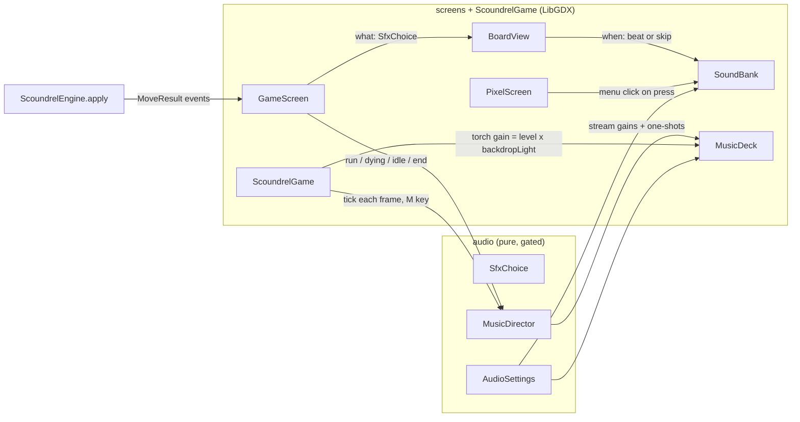

# Scoundrel — Audio

This documents the game's sound: the decisions locked in the audio design interview, every
sound and when it plays, the file contract, the mix and its controls, the architecture, and
where the audio comes from. It complements [`design.md`](design.md) (the rules engine) and
[`ui.md`](ui.md) (the screens). Keep all three in sync with the code.

The plan that builds it is
[`superpowers/plans/2026-09-24-audio.md`](superpowers/plans/2026-09-24-audio.md), the record of
intent and progress. **This file is the record of what ships.**

> ## Where this stands, 2026-09-24
>
> **Nothing plays yet.** The game makes no sound: no screen calls audio code. Three things
> exist:
> - The synthesis toolchain (`audio-source/`: `6d2e267`, `81cc0a3`).
> - The 29 **placeholder** sound effects it renders, in `assets/audio/sfx/`. They pass every
>   measurement but haven't been through listening round 1.
> - The pure `audio` package, built and tested (`e49a6bb`…`b8e7f74`) but not yet wired in. It
>   decides which sound each moment makes, holds sounds for their beats, sequences the music,
>   and keeps the volume settings.
>
> Every section below carries a **Status** line. It says **planned** until the part is built,
> then **shipped** with the commit that shipped it. A section marked *planned* describes a
> decision, not the game. Don't cite it as current behaviour.

## Locked decisions (from the design interview)

**Status: decided** (interview 2026-09-23; planning decisions approved 2026-09-24).

- **Crunchy lo-fi.** Grounded sounds (thuds, steel, glass, fire) with a retro edge: sample-rate
  reduction, mild bit-crushing, a low-pass. Not pure chiptune, which reads as cheerful against a
  torchlit dungeon.
- **One sound per moment.** The game is fast: cards act on press, and a click during an
  animation skips it. So every moment gets exactly one sound, and any sound that would always
  coincide with another is cut. The list below is closed; push back on additions.
- **Sound follows the picture.** A sound plays on its animation's beat, not when the engine
  applies the move. A skipped animation plays its pending sound at once, so every action
  sounds exactly once however fast you click.
- **Two tracks and two cues.** A menu track and a run track on the same theme (the menu is the
  run track stripped back), plus win and death cues. The run track is slow and brooding. All
  three modes share it, and the tutorial sounds like a normal run.
- **The picture cuts, the music doesn't.** Screen transitions stay cuts (`ui.md`). Music
  crossfades instead: audio is a deliberate exception, like the smooth torch backdrop.
- **Placeholder-first.** Claude synthesizes every sound so the whole game is wired and timed,
  then the user listens and weak sounds are replaced from approved sources (see **Sourcing**).
- **Claude can't hear.** Audio is verified by measurement and by an in-game sound log; the user
  is the ear (see **Verification**).

## The sounds

**Status:** the choice of sound is implemented and tested (`Sound`, `SfxChoice`: `c7c2251`).
Nothing plays it yet.

| Sound | Plays when | Weighted by |
|---|---|---|
| **Click** | A menu button is pressed: title, mode select, ledger, trophies, and the end-of-run panel | — |
| **Flip** | Each card dealt into the room lands | — |
| **Sweep** | A room is avoided | — |
| **Equip** | A weapon lands on the rail | weapon value |
| **Weapon kill** | The blade lands on a monster: a *blade* weighted by the weapon, plus a *thud* only if damage got through | weapon; damage let through |
| **Strike** | A monster is fought bare-handed (both blows in one sound) | monster value |
| **Drink** | A potion pours, **including at full health** (it heals 0 but is still a drink) | potion value |
| **Spill** | A wasted potion (the second in a room) spills | — |
| **Chime** | TROPHIES UNLOCKED appears on the end panel | — |
| **Torch** | Always: a crackle loop on every screen, quietly under the music | follows the torch's brightness |

**Deliberately silent:**
- Buttons pressed **during a run**: the Avoid plate, the fight/weapon chooser, the tutorial
  callout's NEXT and SKIP. The sound that follows each press covers it.
- A weapon wearing down: `WeaponDegraded` fires in the same instant as every weapon kill.
- The old weapon being discarded: it happens inside equipping.
- A heal: it would sit on the drink.
- Taking damage: it's folded into the hit. A clean weapon kill is crisp; one that costs health
  lands heavier.
- A new best score: the win cue covers it.

### Weights and versions

Each sound is one recipe, rendered at up to three weights as separate files. A heavier weight
has more low end, a longer tail and more layers. A small pitch change by exact value separates
cards that share a weight: ±4% across the weight, lighter values higher. The nudge restarts in
each weight, because the file already says "heavier".

| Scale | Light | Medium | Heavy |
|---|---|---|---|
| Weapon (equip, blade) | 2–4 | 5–7 | 8–10 |
| Potion (drink) | 2–4 | 5–7 | 8–10 |
| Monster (strike) | 2–5 | 6–10 | 11–14 |
| Damage let through (thud) | 1–4 | — | 5+ (0 = no thud) |

- **Weight comes from value only.** Weapons aren't split into edged and blunt, creatures have
  no body types or voices, and a card sounds the same in clubs and spades.
- **Frequent sounds get 2–3 versions**, picked at random and never the same one twice in a row.
  An identical sound repeated reads as mechanical (the "machine-gun effect"), and a full run
  deals 44+ cards and fights 26 monsters.
- **Frequent sounds also vary on every play:** ±2% pitch, and up to 10% quieter, never louder
  than the file was mastered. These are the flip, blade, thud and fist, the sounds with more
  than one version. The ±4% nudge, ±2% pitch and 10% volume are starting values for the
  listening rounds.
- **Rare moments have one version on purpose.** Sounding identical every time is what makes the
  spill, the chime and the cues recognisable.

## Timing

**Status:** the queue that holds each sound for its beat and flushes everything at once on a
skip, collapsing flips, is implemented (`PendingCues`, `4b63cd0`). Reading the beats from the
effects and firing them is planned.

The beats are read from the effect classes, which run at 12 fps (one frame = 83 ms). Times are from the start of each effect. Figures re-derived from the constants on
2026-09-24.

| Sound | Beat | Source |
|---|---|---|
| Strike | 0 ms; the two blows are 83 ms apart, both in one file | `Barehanded.HIT_FRAMES` |
| Weapon kill | 167 ms, as the blade lands | `WeaponKill.SLASH_START` |
| Equip | 250 ms, landing on the rail | `CardFlight.EQUIP` |
| Sweep | 0 ms; the room is gone at 250 ms | `CardFlight.AVOID` |
| Drink | 417 ms, as it pours, through the existing `onPour` hook | `PotionDrink.POUR_START` |
| Spill | 250 ms | `PotionSpill.SPILL_START` |
| Flips | The deal starts once the effect ends. Card *n* lands at 250 / 333 / 417 / 500 ms | `CardFlight.dealTo` |
| Click | On press, as the plate sinks, not on release | `PressGesture.press` |

- **The killing blow runs at half speed** (`BoardView.effectRate` = 0.5), so its beat lands
  twice as late. Beats are measured on the effect's own clock, never hard-coded.
- **Skipping:** any click during an animation calls `BoardView.skip()`
  (`GameScreen.java:185–186`), which plays every pending sound once. A skipped deal plays **one**
  flip, not four at once.

## Music and ambience

**Status:** the sequencing below is implemented and tested (`MusicDirector`, `b8e7f74`). No track
exists or plays yet.

**Placeholder composition:** D minor, about 64 BPM, loops of about 60–90 s.

| Track | Content |
|---|---|
| Run | A drone, a sparse plucked melody (Karplus-Strong string synthesis), a soft low pulse |
| Menu | The same melody over the drone only |
| Win cue | Resolves the minor theme onto a major chord (a Picardy third) |
| Death cue | Sinks and goes out |
| Torch | A crackle loop |

**Sequences:**
- **Between menus:** the menu track plays on, **without restarting**, across the title, mode
  select, ledger and trophies.
- **Menu ↔ run:** a short crossfade (1 s to start with) while the picture cuts. It uses an
  equal-power curve, so the middle of the fade doesn't dip in loudness.
- **Death** (real runs only; the tutorial has no death sequence, per `GameScreen.java:1001`).
  It follows `DeathCinematic`:
  - The run music plays through the flare, the shake and the settle.
  - It fades out with the torch going out, from 1.25 s to 2.75 s. The torch crackle follows the
    torch's own brightness down, since its volume is the screen's `backdropLight()`.
  - A beat of silence.
  - The death cue at ≈ 3.42 s, as YOU DIED grows in.
  - Clicking through fades quickly and plays the cue at once if it hasn't played yet, never
    twice.
- **Win:** the end panel appears immediately, while the winning move is still animating. So the
  run music fades when the board goes idle, then the win cue plays.
- **The chime** (only if a trophy was unlocked) waits for **both** the end panel and this run's
  cue to finish, after a win or a death, so it never lands on top of either. Clicking through a
  death puts the panel up at once, and the chime then waits for the death cue. A cue ending
  from an earlier run is ignored.
- **The end panel is quiet:** only the torch. The menu track returns on MAIN MENU, TROPHIES or
  THE LEDGER; the run track restarts on NEW GAME.

## Mix and controls

**Status:** the levels, gains, mute and settings file are implemented and tested
(`AudioSettings`, `AudioSettingsStore`: `4e98b05`). The plates, M, the minimise pause and the
no-device check are planned.

- **Two plates on the title, MUSIC and SOUND**, below the four menu buttons. Each cycles up
  through three levels and wraps to OFF on release, like any menu button, and the SOUND plate
  plays the click at its new level. **Changing a level also un-mutes**, since turning a volume
  is a request to hear it. The mock has no plates, so placement is signed off by screenshot.
- **Level gains:** 3 = 0 dB, 2 = −6 dB, 1 = −12 dB, 0 = off. On first launch music is at 2 and
  sound at 3, so music sits below the effects.
- **M mutes and unmutes everything from any screen.** It's checked in `ScoundrelGame.render()`
  beside F11, and was unbound when this was written. During a run the event feed shows SOUND
  OFF / SOUND ON, since nothing else on the board would show it.
- **Settings file:** `~/.scoundrel/audio.settings`, one versioned line of tab-separated
  key=value tokens (`v=1	music=2	sound=3	muted=false`), the shape of a run-log line.
  - A missing file, or one that isn't version 1, means the defaults.
  - In a version-1 file, a bad value falls back for that key alone.
  - Read or write failures throw, as the sibling stores do, and the game carries on with the
    defaults.
  - **The full progress reset doesn't touch it:** it's a setting, not progress. `ProgressTest`
    pins this.
- **Minimising the window pauses the audio.** This is checked by logging from the running game,
  not by reasoning about the backend.
- **No audio device means silence, never a crash.** LibGDX 1.14.2 already switches to a silent
  mock when OpenAL can't start ("Couldn't initialize audio, disabling audio", checked in the
  jar). Every load and play is also guarded, so a missing or bad file is silent plus one log
  line.
- **Mix targets** (the sound-effect ones are enforced by `check.py`, and the music ones will be
  in Task 6):
  - Every file peaks at or below −1 dBFS. For OGG that's measured on the **decoded** file, since
    Vorbis overshoots by about 0.2 dB.
  - At most 5 ms of silence at the start of a sound effect.
  - Tails decay to silence, with no DC offset.
  - **Each sound effect has a loudness target, measured as heard**: its loudest 50 ms after
    ITU-R BS.1770 K-weighting. The weighting counts deep bass for less and the range above
    about 2 kHz for more, the way the ear does. Plain RMS, used first, left the thud 7 dB
    under the blade it plays beneath, and round 1 heard it as barely there.
  - **Targets are relative to one another:**
    - The weapon kill's blade and thud are the loudest, around −13 dBFS as heard.
    - The equip, fist, sweep, spill, drink and chime sit between −15.5 and −20.
    - The click is at −23 and the flips at −25, because they come on every menu press or four
      at a time.

    The live values are in `audio-source/recipes.py`, tuned by ear.
  - Music sits below the sound effects.

## Architecture

**Status:** the pure half has shipped (`e49a6bb`…`b8e7f74`). The screens half is planned.

The engine already exposes everything audio needs. `apply(state, move)` returns the events,
and the effects already have their beats. Nothing in `model` or `rules` changes.



- **`audio`**: a new pure package with no LibGDX, held to the coverage gate like the other pure
  packages (`CoverageGateTest` enforces it). It decides *what* plays:
  - `Sound`: the closed list of ten effects and the file contract.
  - `Weight` and `Scale`: the value bands and the pitch nudge.
  - `SfxChoice`, with `VariantPicker`, turns events into `Sfx` (file, pitch, volume).
  - `PendingCues`: holds sounds for their beats.
  - `MusicDirector`: sequences the tracks and cues.
  - `AudioSettings` and `AudioSettingsStore`: the volume.

  It references only `rules`. Timing that lives in `screens` (the death sequence's constants)
  is passed in.
- **`screens`** decides *when*:
  - `Beats` is a pure, tested helper that reads each beat from the effect classes.
  - `BoardView` fires sounds on their beats, and on `skip()`.
  - `SoundBank` plays the sound effects and caps how many copies of each play at once.
  - `MusicDeck` streams the tracks.
  - The F9 animation lab plays the same sounds through the same `BoardView`.
- **`ScoundrelGame`** owns the bank, the deck, the director and the settings, like `Theme` and
  `Sprites`. Running the director there is what lets music survive screen changes.
- **Sound log:** `-Dscoundrel.audio.log=true` logs every sound and one-shot with a millisecond
  timestamp. This is how GL-side timing is verified.

## Asset contract

**Status:** the list of names is in code (`Sound.allFiles()`, `c7c2251`). The 29 sound-effect
files exist as placeholders (`81cc0a3`), and `AudioAssetsTest` holds them to the list
(`7542da4`). The five streamed files are planned.

**File names are the contract**, like the sprite region names. Unweighted sounds are
`<sound>_<version>`; weighted ones are `<sound>_<weight>_<version>`, where the weight is
`light`, `medium` or `heavy`. The Java side's list is `Sound.allFiles()` (`c7c2251`), which
`SoundTest` pins to the table below by hand. `AudioAssetsTest` checks the folder matches it
**exactly**: a stray file fails too, because everything in `assets/` ships.

**Sound effects**, in `assets/audio/sfx/`. WAV, 16-bit PCM, mono, 44.1 kHz. **29 files:**

| Sound | Files | Count |
|---|---|---|
| click | `click_1` | 1 |
| flip | `flip_1` … `flip_3` | 3 |
| sweep | `sweep_1` | 1 |
| equip | `equip_{light,medium,heavy}_1` | 3 |
| blade | `blade_{light,medium,heavy}_{1,2}` | 6 |
| thud | `thud_{light,heavy}_{1,2}` | 4 |
| fist (strike) | `fist_{light,medium,heavy}_{1,2}` | 6 |
| drink | `drink_{light,medium,heavy}_1` | 3 |
| spill | `spill_1` | 1 |
| chime | `chime_1` | 1 |

**Streamed audio**, OGG Vorbis at 44.1 kHz. Music is stereo; the torch is mono. **5 files:**
`assets/audio/music/{menu,run,win,death}.ogg` and `assets/audio/ambience/torch.ogg`.

**Why the files are committed rather than built:** the sprite atlas is built by Gradle and
gitignored, but audio is rendered by Python (numpy plus an OGG encoder). CI and anyone building
the game shouldn't need either, so the renders are committed and a test guards the contract.

## Regenerating the audio

**Status:** shipped for the sound effects (`6d2e267`, `81cc0a3`). The music scripts are planned
(Task 6).

```bash
python -m pip install --user -r audio-source/requirements.txt   # numpy 2.5.3, soundfile 0.14.0
python audio-source/render.py      # renders assets/audio/sfx/ (under a second)
python audio-source/check.py       # measures every file; non-zero exit on any failure
python audio-source/audition.py    # builds audio-source/build/audition.html to listen to
```

`audio-source/README.md` describes each script.

- **`audio-source/`** sits outside `assets/`, like `art-source/`.
- **Recipes use fixed seeds**, so the same seed gives a byte-identical file. That's why the
  requirements pin exact versions.
- **Audition pages and scratch renders go in `audio-source/build/`** (gitignored), never in
  `assets/`.
- **A replaced placeholder is never rendered over.** Its name goes in
  `audio-source/replaced.txt`, which `render.py` skips and `check.py` stops comparing against a
  fresh render.

## Sourcing

**Status:** the rules are in force; the ledger starts empty of replacements.

Placeholders are ours (synthesized). A replacement may come from:

- **CC0:** no credit needed.
- **CC-BY:** credited in `assets/audio/CREDITS.txt`, created with the first CC-BY file.
- **AI-generated:** disclosed alongside the Claude collaboration in portfolio material, with the
  tool's commercial terms checked on the day it's used and the date recorded.
- **Paid packs or a commission.**
- **Never non-commercial (NC) licences**, so a future sale never forces a re-source.

**The ledger.** Status goes *planned* → *placeholder* → *approved* or *replaced*, with source,
author and licence recorded on replacement.

| Files | Status | Source | Licence |
|---|---|---|---|
| `sfx/*` (29) | placeholder (`81cc0a3`). Round 1: flips, blade and thud rebuilt; re-listen pending | synth | ours |
| `ambience/torch` | planned | synth | ours |
| `music/menu`, `music/run` | planned | synth | ours; most likely to be replaced |
| `music/win`, `music/death` | planned | synth | ours |

## Verification

**Status:** the unit tests, `AudioAssetsTest` and `check.py` for the sound effects are in force.
The in-game sound log and the listening rounds are still ahead.

- **Pure logic is unit-tested first:** weights, versions, event-to-sound mapping, pending cues,
  the music director, and settings. Eight test classes in `core/src/test/java/.../audio`, plus
  the `ProgressTest` guard. `core:check` gates it: `audio` had 100% line coverage when Task 3
  closed.
- **`AudioAssetsTest`** (JUnit, using the JDK's `javax.sound.sampled`, no LibGDX) checks the
  file set, format, peak and leading silence of the sound effects.
- **`check.py`** measures what Java can't: loudness against each target, silent tails, DC,
  length, versions that aren't near-copies, and the committed files matching a fresh render. It
  also reports brightness by weight. From Task 6 it will cover loop seams and the decoded OGGs.
- **Timing in the game** is checked from the sound log during a run driven by the
  `run-scoundrel` skill, compared against **Timing** above to within one render frame.
- **Whether it sounds right is the user's call**, in three listening rounds: the sounds alone,
  the sounds in play, then the music and sequences. Claude never claims how something sounds.
