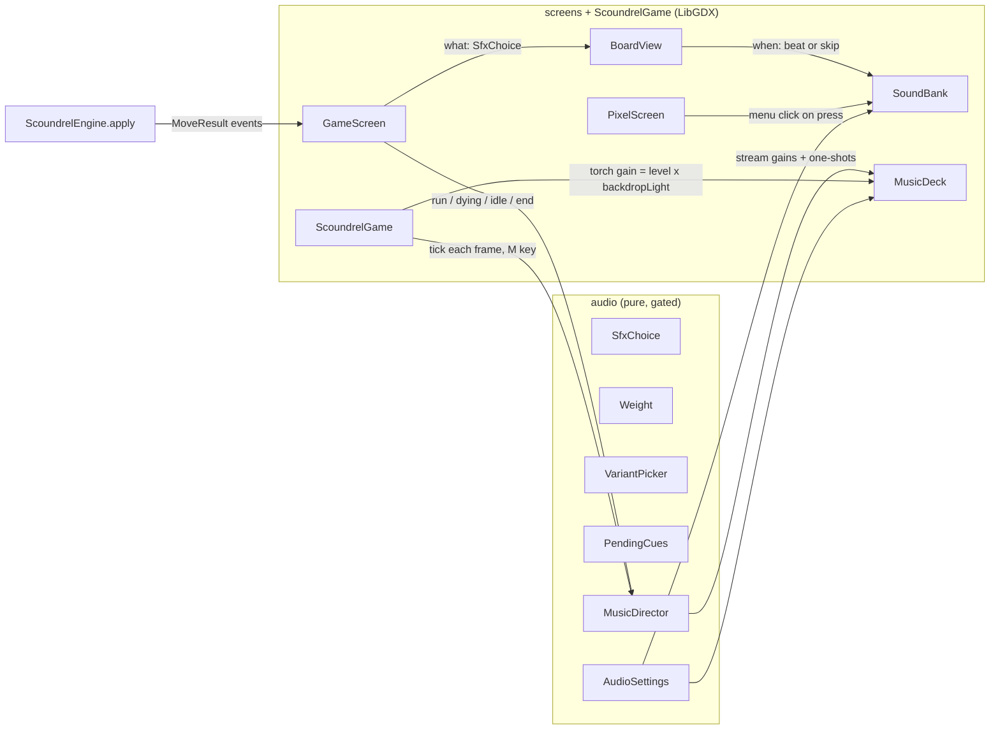

# Audio Implementation Plan

> ## 🟡 Status: in progress; Tasks 1–7 done, Task 8 next (2026-09-24)
>
> The design was locked in the 2026-09-23 interview. This plan and all nine planning decisions
> were approved on 2026-09-24. All work is on the **`audio` branch**.
>
> **The game plays its sound effects, music, both cues and the torch loop**, verified from the
> in-game sound log, and all three listening rounds are signed off. **Task 7, the controls, is
> done** (`6cccf54`…`8491e49`); the user signed off the plates' placement. **Next: Task 8, the
> docs sync.**
>
> Update this banner, the **Roadmap** checkboxes and the **Session log** in the same commit as
> the work they describe. When the work is finished, turn the banner into an "Executed" note like
> [`2026-08-13-code-health-r1-r6.md`](2026-08-13-code-health-r1-r6.md), listing every step that
> did not survive contact with the code.

## Resuming in a new session

1. **`git switch audio`.** The work lives on that branch, not on `main`. Then read this file top
   to bottom. Every decision is here; the conversation that produced it is gone.
2. **Find the first unchecked item in the Roadmap.**
3. **Don't trust the checkboxes; verify them.** Run
   `git log --oneline -- audio-source assets/audio core/src/main/java/com/tomer/scoundrel/audio`
   to see what was actually committed, then open the files. The line numbers under **Code
   anchors** were correct at `51b4da8` and will drift.
4. **Follow `CLAUDE.md`**: tests first for pure logic, commit each working piece, and verify
   GL work with screenshots or logs. Read `core/src/main/java/com/tomer/scoundrel/screens/CLAUDE.md`
   before touching a screen.
5. **When a step turns out wrong in the code**, do the right thing and record it under
   **Deviations**. Don't follow a wrong step silently.

## Roadmap

- [x] **Design interview**: three rounds plus the SFX trim (2026-09-23)
- [x] **Plan approved**, nine planning decisions locked (2026-09-24)
- [x] **This file** (2026-09-24)
- [x] **Task 1:** Tooling, an OGG encoder (2026-09-24: soundfile 0.14.0)
- [x] **Task 2:** The `docs/audio.md` reference (2026-09-24)
- [x] **Task 3:** The pure `audio` package, tests first (2026-09-24, `e49a6bb`…`b8e7f74`)
- [x] **Task 4:** Synthesize the 29 sound effects, plus `AudioAssetsTest` → 🎧 **Listening round 1**
      (2026-09-24: built in `81cc0a3` and `7542da4`; round 1 tuning in `b1409ab` and `be29bfe`;
      signed off with the deal's riffle)
- [x] **Task 5:** `SoundBank`, the timing hooks, the menu click, sounds firing on skip → 🎧 **Listening round 2**
      (2026-09-24: built and verified in the game in `abddca8`, `c658e86`, `a00041d`; round 2
      signed off unchanged)
- [x] **Task 6:** Music, the torch loop and `MusicDirector` → 🎧 **Listening round 3**
      (built and verified in the game 2026-09-24: `f6b11d4`, `c62b309`, `29bb050`, `9aca6c1`,
      `4d0a625`, `7a2d9f6`; round 3 tuning in `8af222e`; signed off 2026-09-24)
- [x] **Task 7:** Controls: title plates, M, saved settings, ~~pause~~ silence when minimised,
      no-device check (2026-09-24):
      - Built and verified in the game: `6cccf54`, `71eddaa`, `63a8c84`, `652a013`, `c0b45d9`.
      - After the user's first look: the M line `61475a7`, audio playing on `c3f94c9`.
      - Then, at the user's word, silent but keeping time: `8491e49`.
      - The plates were signed off from the screenshots.
- [ ] **Task 8:** Docs sync and memory
- [ ] **Later, open-ended:** replace weak placeholders from approved sources (see **Sourcing ledger**)
- **Not in scope:** a release. That's a separate decision (version bump, `CHANGELOG`, tag, per
  `CLAUDE.md`).

**Goal:** Give Scoundrel sound effects, music and ambience that fit a fast-paced, torchlit
pixel game. There is one sound per moment, each plays on its animation's beat, and the game
never crashes because of audio. It ships first as placeholders Claude synthesizes, so the whole
game is wired and timed before any sound is sourced.

**Architecture:** A new pure `audio` package decides *what* plays: which file, how loud, and
which music track at what volume. It observes `model`/`rules` from outside, the way
`achievements` does. The `screens` layer decides *when*: `BoardView` fires each sound on its
animation's beat, or at once when the animation is skipped. A LibGDX-side `SoundBank` and
`MusicDeck` play the files. `ScoundrelGame` runs the music every frame so it survives screen
changes. The sounds are rendered offline by Python scripts in `audio-source/` and committed
under `assets/audio/`.

**Tech stack:** Java 21, LibGDX 1.14.2 (LWJGL3 / OpenAL), JUnit 5 + JaCoCo. For offline
synthesis: Python 3.14 + numpy, plus an OGG encoder (Task 1).

## Global constraints

Every task's requirements implicitly include these.

- **Purity.** No `com.badlogic.gdx.*` in `model`, `rules`, `runs`, `achievements`, `tutorial`
  **or `audio`**. Verify: `grep -rl 'com.badlogic.gdx' core/src/main/java/com/tomer/scoundrel/{model,rules,runs,achievements,tutorial,audio}`
  must print nothing.
- **Imports run one way.** `model`/`rules` never import `audio`. `audio` may import
  `model`/`rules` and nothing else of ours (not `runs`, `achievements`, `tutorial` or `screens`).
  Timing numbers that live in `screens` are passed in, not imported.
- **`./gradlew core:check` is green before every commit.** Baseline measured 2026-09-24: 601
  `@Test` annotations in 76 test classes (by grep). The coverage gate is 90% of lines and 75%
  of branches per pure package. `CoverageGateTest` fails until `audio` is added to the gate.
- **Tests first (red-green)** for all pure logic. GL work is verified by screenshot or by the
  in-game sound log (`CLAUDE.md`).
- **One commit per working piece**, with a lowercase conventional prefix matching `git log`.
- **Audio never crashes the game.** Every load and play is guarded. A missing or bad file means
  silence plus one log line.
- **Sound follows the picture.** A sound fires on its animation's beat, never when the move is
  applied, and a skipped animation fires its pending sound at once.
- **The screen rules don't change.** Screens still cut. Audio crossfades are a deliberate
  exception, like the smooth torch backdrop.
- **The sound list is closed.** The user's call: in a fast-paced game there is one sound per
  moment. Push back on any new sound that would coincide with an existing one.
- **Claude can't hear.** Verify with measurements and the sound log; the user is the ear at
  each listening round. Never claim how something *sounds*.
- **Never hand-edit `assets/assets.txt`.** Everything in `assets/` ships, so audition pages,
  scripts and source files stay out of it.

## Locked design (interview, 2026-09-23)

### Direction and sourcing

- **Overall sound: crunchy lo-fi.** Grounded sounds (thuds, steel, glass, fire) given a retro
  edge through sample-rate reduction, mild bit-crushing and a low-pass filter. **Not** pure
  chiptune.
- **Sourcing: placeholder-first.** Claude synthesizes everything; the user listens; weak sounds
  get replaced.
- **Approved replacement sources:**
  - CC0 (free, no credit).
  - CC-BY: credit in `assets/audio/CREDITS.txt`, created with the first CC-BY file.
  - AI-generated, disclosed. Check the tool's current commercial terms on the day it's used,
    and disclose it alongside the Claude collaboration in portfolio material.
  - Paid packs or a commission.
  - **Non-commercial (NC) licences are excluded**, so a future sale never forces a re-source.

### Music: two tracks and two cues

- **Run track:** slow and brooding. All three modes (Standard, Relentless, Frail) share it.
- **Menu track:** the same theme, stripped back.
- **Win cue and death cue:** short one-shots.
- **The tutorial** sounds like a normal run.

### Sound effects: one per moment

| Sound | Weighted by | Moment |
|---|---|---|
| Menu click | — | Title, mode select, ledger, trophies, end-of-run buttons |
| Card flip | — | Each card dealt (neutral; no boss warning, no per-type sound) |
| Avoid sweep | — | Room avoided |
| Equip | weapon value | Weapon taken |
| Weapon kill | weapon (blade) + damage let through (thud) | Monster killed with a weapon |
| Bare-handed strike | monster value | Monster fought bare-handed |
| Drink | potion value | Potion taken, **including at full health** (heals 0, still a drink) |
| Spill | — | Wasted second potion in a room |
| Achievement chime | — | When TROPHIES UNLOCKED appears on the end panel |
| Torch crackle (loop) | — | Every screen, quietly under the music |

**Cut** (each would coincide with a sound already on the list):
- Button sounds during a run.
- Weapon wearing down (it fires with every weapon kill).
- The old weapon being discarded (it happens inside equip).
- A separate heal sound (it would sit on the drink).
- A separate hurt sound (damage is folded into the hit).

### Weighting

- **Each sound is one recipe, built at three weights** (light / medium / heavy) as separate
  files. A small pitch change by exact value separates cards within a weight. Only frequent
  sounds get versions, chosen at random and never the same one twice in a row. Rare moments
  (spill, chime, cues) sound identical every time on purpose, so they're recognisable.
- **The weights:**
  - Weapons and potions: 2–4 light, 5–7 medium, 8–10 heavy.
  - Monsters: 2–5 light, 6–10 medium, 11–14 heavy.
  - Damage let through on a weapon kill: 0 = none, 1–4 light, 5+ heavy.
- **Weight comes from value only.** No edged/blunt weapon split, no creature body types or
  voices, and clubs and spades sound the same.
- **Damage folds into the hit.** A weapon kill that costs no health sounds crisp; one that lets
  damage through lands heavier.

### Behaviour

- **Menus to run:** music crossfades while the picture still cuts. The menu track does **not**
  restart when you move between menu screens.
- **Torch crackle** plays on every screen and follows the torch's brightness.
- **Death:** the run music and the crackle die with the torch as it goes out. A beat of silence
  follows, then the death cue as YOU DIED grows in.
- **Skipping:** a skipped animation fires its pending sound at once, so every action sounds
  exactly once. This matters because every click during an animation skips it, so fast play
  skips constantly.

### Controls and defaults

- **Two plates on the title, MUSIC and SOUND**, each cycling through levels. M mutes everything
  from any screen.
- **Levels are saved in `~/.scoundrel/audio.settings`** and survive the full progress reset
  (they're settings, not progress).
- **First launch:** both on, with music below effects.
- ~~**Audio pauses when the window is minimised.**~~ *Changed by the user on 2026-09-24, after
  seeing it built: minimised, the audio is silent but keeps time with the picture, since a held
  cue could sound minutes after its moment.* With no audio device the game runs silently
  and never crashes.
- **A new best score gets no cue of its own.**

## Planning decisions (approved 2026-09-24)

1. **Weapon kill** = a *blade* sound weighted by the weapon, plus a *thud* only when damage gets
   through (1–4 light, 5+ heavy). A clean kill is blade only. The monster's value is heard
   only through the damage it does.
2. **Deal:** one flip per card as it lands. *Refined in listening round 1: the flips of a deal
   are shaped as one riffle (overlapping swishes, each later card quieter and lower). See
   Deviations.* A skipped deal plays a **single** flip, not four
   at once.
3. **The menu click plays on press**, when the plate visibly sinks, not on release.
4. **The tutorial callout's NEXT and SKIP buttons are silent.** They're pressed during a run.
   The end-of-run panel's buttons do click.
5. **Win:** the run music fades out when the last animation finishes, then the win cue plays,
   then the achievement chime (if any) after the cue.
6. **The end-of-run panel is quiet**: only the torch crackle. The menu track returns when you go
   to a menu screen; the run track restarts on NEW GAME.
7. **M during a run** shows SOUND OFF / SOUND ON in the event feed.
8. **Levels:** OFF plus 3 steps (step 3 = 0 dB, 2 = −6 dB, 1 = −12 dB). On first launch music is
   at step 2 and sound at step 3.
9. **Placeholder music:**
   - D minor, about 64 BPM, loops of about 60–90 s.
   - Run track: a drone, a sparse plucked melody (Karplus-Strong string synthesis) and a soft
     low pulse.
   - Menu track: the same melody over the drone only.
   - Win cue: ends on a major chord (a Picardy third).
   - Death cue: sinks and goes out.

## Timing: when each sound fires

Effects run at 12 fps (one frame = 83 ms). Times are from the start of the effect. The killing
blow runs at half speed (`BoardView.effectRate` = 0.5), so its beats land twice as late. Beats
should be computed on the effect's own clock rather than hard-coded.

| Sound | Beat | Source of truth |
|---|---|---|
| Bare-handed strike | 0 ms. Two blows 83 ms apart, both in one file | `Barehanded.HIT_FRAMES` |
| Weapon kill (blade + thud) | 167 ms, as the blade lands | `WeaponKill.SLASH_START` |
| Equip | 250 ms, landing on the rail | `CardFlight.EQUIP` (3 hops × 1 frame) |
| Avoid sweep | 0 ms. The room is gone at 250 ms | `CardFlight.AVOID` |
| Drink | 417 ms, the pour (the existing `onPour` hook) | `PotionDrink.POUR_START` |
| Spill | 250 ms | `PotionSpill.SPILL_START` |
| Deal flips | The deal starts after the effect ends. Card *n* lands at 250 / 333 / 417 / 500 ms | `CardFlight.dealTo` (1-frame stagger, 3 hops) |
| Menu click | On press, as the plate sinks | `PressGesture.press` |
| Death: music and crackle fade | 1.25 s → 2.75 s (the torch going out) | `DeathCinematic.DITHER_START` / `DITHER_END` |
| Death cue | ≈ 3.42 s, as YOU DIED grows in | `DeathCinematic.TITLE_START` |
| Death, clicked through | Quick fade; the cue plays now if it hasn't yet | `GameScreen.settleEnd` |
| Win cue | When the board goes idle after the winning move | `BoardView.isPlaying()` |
| Chime | Death: when the end panel appears. Win: after the win cue | `GameScreen.newlyUnlocked` |

## Asset contract

The file names are the contract, like the sprite region names. Unweighted sounds are named
`<sound>_<version>`; weighted sounds are `<sound>_<weight>_<version>`, where weight is `light`,
`medium` or `heavy`. The Java side derives the expected set from the same code that names the
files, and `AudioAssetsTest` checks the folder matches it exactly.

**Sound effects**, in `assets/audio/sfx/`. WAV, 16-bit PCM, mono, 44.1 kHz. **29 files:**

| Sound | Files | Count |
|---|---|---|
| click | `click_1` | 1 |
| flip | `flip_1` … `flip_3` | 3 |
| sweep | `sweep_1` | 1 |
| equip | `equip_{light,medium,heavy}_1` | 3 |
| blade | `blade_{light,medium,heavy}_{1,2}` | 6 |
| thud | `thud_{light,heavy}_{1,2}` | 4 |
| fist | `fist_{light,medium,heavy}_{1,2}` | 6 |
| drink | `drink_{light,medium,heavy}_1` | 3 |
| spill | `spill_1` | 1 |
| chime | `chime_1` | 1 |

**Streamed audio**, OGG Vorbis at 44.1 kHz. Music is stereo; the torch is mono. **5 files:**
`assets/audio/music/menu.ogg`, `run.ogg`, `win.ogg`, `death.ogg`, and
`assets/audio/ambience/torch.ogg`.

**Total: 34 files.** These are design counts; check the folder for the real state.

**Loudness targets as set in Task 4**, measured as the loudest 50 ms in dBFS, and tuned by ear in
round 1. The live values are in `audio-source/recipes.py`:

| Sound | Target (dBFS) |
|---|---|
| click, flip | −24 |
| sweep | −22 |
| equip | −18 / −17 / −16 (light / medium / heavy) |
| blade, fist | −17 / −16 / −15 |
| thud | −20 / −18 (light / heavy) |
| drink | −20 / −19 / −18 |
| spill | −21 |
| chime | −18 |

**The lo-fi stage defaults:** hold at 18 kHz, 10 bits, low-pass at 8.5 kHz. The blade's
low-pass is 9.5 kHz. The thud holds at 14 kHz with a 6 kHz low-pass, and the fist at 16 kHz with
7 kHz. The chime uses 11 bits and 10 kHz.

**Starting mix targets:**
- Every file peaks at or below −1 dBFS.
- Every sound effect has at most 5 ms of silence at the start, so its attack lands on the beat.
- Every file's tail decays to silence.
- There's no DC offset.
- Sound effects are matched on RMS loudness within a category.
- Music is normalised quieter than the sound effects.

## Architecture

**`audio` (pure, new, added to the coverage gate):**

| Class | What it does |
|---|---|
| `Weight` | Sorts a value into light / medium / heavy: `ofWeapon`, `ofPotion`, `ofMonster`, and `ofDamageThrough` (none for 0). |
| `SfxChoice` | Turns a moment into file names plus a pitch, e.g. `equip(weapon)`, `weaponKill(weaponValue, damage)` → blade (+ thud), `strike(monster)`, `drink(potion)`, `spill()`, `sweep()`, `flip()`, `click()`, `chime()`. Maps every `GameEvent` type, including those that make no sound (`WeaponDegraded`, `RoomDealt`, `GameWon`, `GameLost`). Owns the list of expected files. |
| `VariantPicker` | A seeded random choice of version that never repeats back to back. |
| `PendingCues` | Queues sounds for their beats. Reports what's due, and on skip flushes everything pending exactly once, collapsing pending flips into one. |
| `MusicDirector` | Given the place (menu or run), the death timings (passed in from `DeathCinematic`), click-through, board idle and elapsed time, it produces each track's volume and the one-shot triggers (win cue, death cue, chime). |
| `AudioSettings` | Music and sound levels (0–3), mute, the level-to-gain mapping, cycling, defaults, and the tolerant `v=1` key=value store in `~/.scoundrel/audio.settings` (following `TutorialFlag`). |

**`screens` (LibGDX):**

| Class | What it does |
|---|---|
| `Beats` | *Pure helper*, unit-tested. Reads each effect's beat times from the effect classes, so moving an animation moves its sound with it. |
| `SoundBank` | Loads the sound effects, plays them with volume × setting × pitch, caps how many copies of each sound play at once (the oldest stops), guards everything, and writes the optional sound log. |
| `MusicDeck` | The streamed tracks and the torch loop, with volumes set each frame from `MusicDirector`. |

`ScoundrelGame` owns `SoundBank`, `MusicDeck`, `MusicDirector` and `AudioSettings`, like `Theme`
and `Sprites`. It checks the M key beside F11 and ~~pauses and resumes the music on minimise~~
keeps the audio silent but on time through a minimise (the user's change, Task 7).

**The sound log:** with `-Dscoundrel.audio.log=true`, every sound and one-shot is logged with a
millisecond timestamp through `Gdx.app.log`. This is how GL-side timing gets verified.

## Code anchors (correct at `51b4da8`; line numbers drift)

- `screens/BoardView.java:141–146`: the pour fires inside `update()`. `:235–245`: `skip()` fires
  a pending pour. **Every sound copies this pattern.** Also: `:33` the `Kind` enum, `:68`
  `effectRate` (0.5 for the killing blow), `:160–170` `effectLength`, `:186–200` `rising()`
  (which cards are still dealing in), `:218` `isPlaying()`, `:347–367` `start(...)`.
- `screens/GameScreen.java`:
  - `:185–186`: any press during an animation calls `board.skip()`.
  - `:971` `applyMove`: events go to the feed, then `playEffect`, then the death starts.
  - `:1028` `playEffect`: the switch over `ResolveEffect`.
  - `:98` `weaponBeforeMove`: the weapon's value for the blade sound.
  - `:305` `backdropLight()`: returns `DeathCinematic.torchLight` during a death. The torch
    crackle's volume comes from here.
  - `:472` `settleEnd()`: reached by clicking through (`:159–161`) or when the death finishes
    (`:352–357`).
  - `:531` `syncBoard()`: shows the end panel. **A win has no cinematic**: the panel appears
    immediately while the last animation is still playing.
  - `:928` `finishRun()`: sets `newlyUnlocked`, the condition for the chime. `:650`
    `drawUnlocked`.
  - `:902` `startRun()`.
- `screens/DeathCinematic.java:26–76`, in frames at 12 fps: flare 2, shake 3, settle 10, torch
  going out 18 (`DITHER_START` 1.25 s → `DITHER_END` 2.75 s), ticker hold 6, black 2.
  `TITLE_START` ≈ 3.42 s; `TOTAL` ≈ 5.67 s.
- `screens/PressGesture.java`: `:53` `press`, `:91` `cancel`, `:106` `advance`. A menu press
  sinks the plate, the release arms the action, and it fires after `MIN_SINK` = 0.06 s.
  `PixelScreen.java:47` owns the gesture; `:119` `backdropLight`; `:132` `keyPressed`.
- `ScoundrelGame.java`:
  - `:58–75`: F11 and F9 are checked in `render()`; **M goes here**. M was unbound at `51b4da8`.
  - `:46–56`: `create()` builds the `~/.scoundrel` stores.
  - `:133–135`: `eraseAllProgress` calls `Progress.eraseAll(runLog, achievements, tutorialFlag)`.
    Audio settings are deliberately not passed.
- `tutorial/TutorialFlag.java`: the tolerant file-store pattern to copy.
- `screens/TitleScreen.java:73–76`: the four menu entries. `ScreenArt.java:68–70, 103`:
  `BUTTON_W` 268, `BUTTON_H` 46, `BUTTON_PITCH` 56, `BUTTONS_Y` 326.
- `core/build.gradle:121–141`: the coverage gate's list of included packages. `:91–111`: how to
  declare test inputs that live outside the module; copy it for `assets/audio`, or edits won't
  re-run `AudioAssetsTest`.
- `lwjgl3/.../Lwjgl3Launcher.java`: no audio settings today.
- **LibGDX 1.14.2, checked in the jars:**
  - With no audio device, the backend logs "Couldn't initialize audio, disabling audio" and
    switches to a silent mock.
  - `Lwjgl3ApplicationConfiguration` has `setPauseWhenMinimized`, `setPauseWhenLostFocus`,
    `disableAudio` and `setAudioConfig`.
  - `Sound.play(volume, pitch, pan)` exists, and so do `Music.setVolume`, `setLooping`,
    `setPosition` and `setOnCompletionListener`.
- **This machine:** Python 3.14.6 with numpy 2.5.3. soundfile 0.14.0 was added in Task 1
  (2026-09-24). **Not installed** (checked 2026-09-23): scipy, ffmpeg, sox, oggenc.

## File structure

**Created**

| File | Responsibility |
|---|---|
| `docs/audio.md` | The lasting reference for what ships: sounds, file contract, timing, levels, sourcing, how to regenerate |
| `core/src/main/java/com/tomer/scoundrel/audio/*.java` | `Weight`, `SfxChoice`, `VariantPicker`, `PendingCues`, `MusicDirector`, `AudioSettings` |
| `core/src/test/java/com/tomer/scoundrel/audio/*Test.java` | One test class per class above, plus `AudioAssetsTest` |
| `core/src/main/java/com/tomer/scoundrel/screens/{Beats,SoundBank,MusicDeck}.java` | Beat times (pure), sound playback, streamed playback |
| `core/src/test/java/com/tomer/scoundrel/screens/BeatsTest.java` | Pins each beat to the effect constant it comes from |
| `audio-source/{README.md,requirements.txt,synth.py,recipes.py,music.py,render.py,check.py}` | Offline synthesis, rendering and measurement |
| `audio-source/build/` (gitignored) | The audition page and scratch renders; never under `assets/` |
| `assets/audio/sfx/*.wav`, `assets/audio/music/*.ogg`, `assets/audio/ambience/torch.ogg` | The 34 rendered files, committed |

**Modified:**
- `ScoundrelGame.java`
- `screens/BoardView.java`, `GameScreen.java`, `PixelScreen.java`, `TitleScreen.java`,
  `ScreenArt.java`
- `lwjgl3/.../Lwjgl3Launcher.java`, only if the minimise pause needs it
- `core/build.gradle`: the coverage gate and the `AudioAssetsTest` inputs
- `.gitignore`: `audio-source/build/`
- `CLAUDE.md`, `docs/ui.md`, `README.md`, `CHANGELOG.md`, `screens/CLAUDE.md`

**Not touched:** `model`, `rules`, `runs`, `achievements`, `tutorial`. The engine and its
events are already sufficient.

---

## Task 1: Tooling, an OGG encoder

- [x] **Ask the user before installing anything.** The user asked for soundfile.
- [x] Install: `python -m pip install --user soundfile`. It bundles libsndfile with Vorbis support.
- [x] Check: `python -c "import soundfile as sf; print(sf.__version__, sf.available_formats().get('OGG'))"`.
- [x] Round trip, in the scratchpad: write a 1 s sine to OGG/Vorbis, read it back, and compare
      length and RMS.
- [x] ~~**Fallback** if there's no build for Python 3.14~~. Not needed: the wheel installed.
- [x] Record the chosen encoder and its version in the **Session log**.

**Verify:** an OGG written by Python decodes to the right length. Nothing in the repo changes
yet except `audio-source/requirements.txt`.

## Task 2: The `docs/audio.md` reference

- [x] Write `docs/audio.md` in the style of `docs/design.md` and `docs/ui.md`: the sound list,
      file contract, timing table, levels and mix, sourcing rules and ledger, and how to
      regenerate. Sections for unbuilt parts say **planned**, so the doc never claims what
      hasn't shipped (the drift `CLAUDE.md` warns about).
- [x] This plan stays the record of intent. `docs/audio.md` becomes the record of what ships,
      and each later task updates it.

**Verify:** every fact in it is checked against the code or files when it's written.

## Task 3: The pure `audio` package (tests first)

For **each** class, in the order `Weight` → `VariantPicker` → `SfxChoice` → `PendingCues` →
`AudioSettings` → `MusicDirector`:

- [x] Write the failing test.
- [x] Run it: `./gradlew core:test --tests '*<Class>Test'`. Confirm it **fails for the right
      reason**, and use `core:cleanTest` if the task could be skipped as up to date.
- [x] Implement until green.
- [x] Commit.

Also:
- [x] Add `'com.tomer.scoundrel.audio'` to the coverage gate in `core/build.gradle`.
      `CoverageGateTest` fails until this is done.
- [x] Test cases that must exist:
  - [x] Weight boundaries for all four scales: 4/5, 7/8 and 5/6, 10/11, and damage 0/1, 4/5.
  - [x] No version repeats back to back, every version is reachable, and a fixed seed gives a
        fixed sequence.
  - [x] Every `GameEvent` type has a defined sound choice (none for `WeaponDegraded`,
        `RoomDealt`, `GameWon`, `GameLost`).
  - [x] A `PotionUsed` with 0 healed gives the drink sound.
  - [x] A clean weapon kill gives the blade only; a costly one gives the blade plus a thud of
        the right weight.
  - [x] The expected-file list is exactly the 29 names in the asset contract (`SoundTest` spells them out by hand).
  - [x] `PendingCues`: fires once on its beat; skip flushes all pending once; pending flips
        collapse into one.
  - [x] `AudioSettings`: defaults (music 2, sound 3, unmuted), cycling, gains by level (0 = off,
        1 = −12 dB, 2 = −6 dB, 3 = 0 dB), a save/load round trip, and a corrupt or missing file falling back to defaults.
  - [x] The progress reset leaves the settings file alone (a test in the root package, next to
        `Progress`).
  - [x] `MusicDirector`:
    - Menu music continues across menu screens without restarting.
    - Menu ↔ run crossfade.
    - Death: the fade over the window passed in, the cue exactly once at the time passed in,
      and click-through fires the cue now and never twice.
    - Win: waits for board idle, then the cue, then the chime after the cue.
    - End panel: silence.
    - NEW GAME restarts the run track; MAIN MENU brings back the menu track.

**Verify:**
- `./gradlew core:cleanTest core:check` is green, with `audio` gated.
- The purity grep including `audio` prints nothing.
- The `@Test` count has risen from 601 (measure it).

## Task 4: Synthesize the 29 sound effects, plus `AudioAssetsTest`

- [x] **`synth.py` primitives** (numpy only; write the filters by hand, no scipy):
  - Oscillators, noise and envelopes.
  - One-pole and biquad filters.
  - Karplus-Strong (plucked string).
  - Modal metal: inharmonic partials that decay.
  - Soft clipping.
  - The lo-fi stage: sample-rate reduction, bit-crushing and a low-pass.
- [x] **`recipes.py`:** one recipe per sound (flip, sweep, equip, blade, thud, fist, drink,
      spill, click, chime), with its weights and versions and **fixed seeds**. Rendering is
      deterministic: the same seed gives a byte-identical WAV.
- [x] **`render.py`** writes `assets/audio/sfx/*.wav`.
- [x] **`check.py`** checks peak, leading silence, silent tail, DC offset, a per-sound maximum
      length (flips must stay short, since cards land 83 ms apart) and per-category RMS
      matching. It exits non-zero on failure.
- [x] **`AudioAssetsTest`** (JUnit, using the JDK's `javax.sound.sampled`, no LibGDX):
  - The folder matches `SfxChoice`'s expected list exactly: none missing, **none extra**.
  - Every file has the right format.
  - Every file peaks at or below −1 dBFS.
  - Every file has at most 5 ms of silence at the start.
  - Declare `assets/audio` as a test input in `core/build.gradle`.
- [x] **The audition page:** `audio-source/build/audition.html` (gitignored), grouped by sound
      and weight, to open locally.
- [x] Commit the scripts and rendered files.
- [x] 🎧 **Listening round 1.** Ask the user, for each sound: does it fit crunchy lo-fi, can the
      weights be told apart, is anything grating on repeat, and is the loudness even?
      Iterate and record the outcome in the **Session log**.

**Verify:** `check.py` passes, `AudioAssetsTest` is green, and the user signs off round 1 or
lists changes.

## Task 5: `SoundBank`, the timing hooks, the menu click, sounds firing on skip

- [x] `Beats` (pure) + `BeatsTest`, tests first. Every beat in the timing table comes from its
      effect constant.
- [x] `SoundBank`:
  - Load all 29 through `Gdx.audio.newSound(Gdx.files.internal("audio/sfx/..."))`, guarded.
  - Play with volume × setting × pitch.
  - Cap copies per sound, with the oldest stopping.
  - The sound log behind `-Dscoundrel.audio.log=true`.
  - Owned and disposed by `ScoundrelGame`.
- [x] `BoardView`:
  - Each effect queues its sound in `PendingCues` on the effect's own clock (so it
    automatically follows the half-speed killing blow).
  - `update()` fires whatever is due.
  - `skip()` flushes pending sounds.
  - Deal flips fire as each card lands, from the `rising()` logic.
- [x] `GameScreen` passes `SfxChoice` results into `BoardView`, with the weapon value from
      `weaponBeforeMove` and damage from the events.
- [x] `PixelScreen` plays the menu click when a press lands on a target. The end panel clicks;
      the tutorial callout does not (decision 4).
- [x] Confirm the F9 animation lab (`SpriteLab`) plays the same sounds through the same
      `BoardView`.
- [x] 🎧 **Listening round 2**: a real run plus the F9 lab. Does each sound land on its moment,
      and does fast play stay clean?

**Verify:**
- Drive a run with the `run-scoundrel` skill and the sound log on. Every action is logged
  exactly once, in order, with beat offsets matching the timing table to within one render
  frame.
- Fast clicking still logs every action once, and a skipped deal logs one flip.
- No visual change.

## Task 6: Music, the torch loop and `MusicDirector`

- [x] **`music.py`**: note data and rendering for `menu`, `run`, `win` and `death` (decision 9),
      plus the `torch` crackle loop. Write OGG through the Task 1 encoder.
- [x] **`check.py` additions:** loop-seam continuity (sample jump and spectral click at the
      wrap), loudness relative to the sound effects, duration, and an OGG round trip. Measure the peak
      on the **decoded** OGG: Vorbis overshoots by about 0.2 dB (Task 1).
- [x] **`MusicDeck`:** streamed playback, guarded, with volumes set each frame.
- [x] **`ScoundrelGame`:**
  - Tick `MusicDirector` every frame.
  - Menu screens report MENU and `GameScreen` reports RUN. That needs a small accessor on
    `PixelScreen`; `SpriteLab` defaults to MENU with full torch.
  - The torch volume is level × the current screen's `backdropLight()`.
- [x] **`GameScreen`:**
  - Pass the death timing (`DeathCinematic.DITHER_START`, `DITHER_END`, `TITLE_START`) to the
    director, along with click-through.
  - Report board idle for the win.
  - Report the chime condition (`newlyUnlocked` not empty).
- [x] 🎧 **Listening round 3**: mood, the loop seams by ear, the crossfades, and the death and
      win sequences.

**Verify:**
- The sound log shows the fade window at 1.25–2.75 s, the death cue once at about 3.42 s
  (within one frame), and click-through firing the cue once.
- Win: cue after idle, then the chime.
- Going title → ledger → trophies → title logs no menu-track restart.
- `check.py` passes the seam checks.

## Task 7: Controls

- [x] **Title:** MUSIC and SOUND plates below the four menu buttons, each showing its level
      (OFF plus 3 pips drawn as whole-pixel rectangles).
  - They cycle on release, with the usual menu behaviour, and play the click at the new sound
    level.
  - Put the geometry in `ScreenArt`. Any new colour goes into `UiPalette` with a comment.
  - Pure layout or label logic goes in a tested helper.
- [x] **M:** checked in `ScoundrelGame.render()` beside F11. Toggles mute on any screen, saves
      the setting, and shows SOUND OFF / ON in the feed during a run (decision 7).
- [x] **Settings:** loaded in `create()` and saved on change. First launch uses the defaults.
- [x] **Minimise:** ~~`ScoundrelGame.pause()`/`resume()` pause and resume the streams.~~
      - It was built that way first (`652a013`).
      - At the user's word it then played on out loud (`c3f94c9`), and finally went silent but
        kept time (`8491e49`): `pause()`/`resume()` set zero gains through `AudioControls`.
      - Verify from the log inside the running game, not by reasoning about the backend.
- [x] **No device:** a launcher system property that sets `disableAudio(true)`, to simulate one.
- [x] **Screenshot the title** and get the user's approval. The mock has no plates, so placement
      is a design sign-off. *(Approved 2026-09-24.)*

**Verify:**
- The screenshot is approved.
- Settings survive a relaunch.
- ~~The log shows the music paused and resumed around a minimise.~~ The log shows a cue starting
  and ending, at volume zero, while the window is minimised.
- A run completes with audio disabled, with no `crash.log` entry.

## Task 8: Docs sync and memory

- [ ] **`CLAUDE.md`:**
  - Add `audio` to the package list.
  - Add `audio` to the purity grep line.
  - Add the regenerate-audio command.
  - Add `docs/audio.md` to References.
  - Keep the file under 200 lines.
- [ ] **`docs/ui.md`:** the title plates, the M key and the audio behaviour.
- [ ] **`screens/CLAUDE.md`:** "sounds fire on beats via `Beats`; never on apply".
- [ ] **`README.md`** features and a **`CHANGELOG.md`** Unreleased entry.
- [ ] **`docs/audio.md`:** switch every *planned* marker to what actually shipped.
- [ ] **Memory:** update `audio-direction.md` to *built*.
- [ ] **This file:** the banner becomes "Executed", with the deviations.

**Verify:**
- `./gradlew core:cleanTest core:check`, then measure the test count and per-package coverage
  from the fresh report.
- The purity grep prints nothing.
- Every changed doc sentence is re-checked against the code.

---

## Listening rounds

| Round | After | What the user judges |
|---|---|---|
| 1 | Task 4 | Each sound on its own (audition page): fit, weight separation, fatigue on repeat, even loudness |
| 2 | Task 5 | In context (a real run + the F9 lab): sounds on their beats, fast play clean, nothing stacking |
| 3 | Task 6 | Music mood, loop seams, crossfades, death and win sequences, torch under the music |

Record each round's verdict and the changes it asked for in the **Session log**.

## Sourcing ledger

Status goes *planned* → *placeholder* → *approved* or *replaced*. A replacement records its
source, author and licence:
- **CC-BY** also goes in `assets/audio/CREDITS.txt`.
- **AI** records the tool, the plan and the date its terms were checked.
- **NC** is never allowed.

| Files | Status | Source | Licence | Notes |
|---|---|---|---|---|
| `sfx/click_1` | planned | synth | ours | |
| `sfx/flip_1–3` | planned | synth | ours | |
| `sfx/sweep_1` | planned | synth | ours | |
| `sfx/equip_*` (3) | planned | synth | ours | |
| `sfx/blade_*` (6) | planned | synth | ours | |
| `sfx/thud_*` (4) | planned | synth | ours | |
| `sfx/fist_*` (6) | planned | synth | ours | |
| `sfx/drink_*` (3) | planned | synth | ours | |
| `sfx/spill_1` | planned | synth | ours | |
| `sfx/chime_1` | planned | synth | ours | |
| `ambience/torch` | planned | synth | ours | |
| `music/menu` | planned | synth | ours | Most likely to be replaced |
| `music/run` | planned | synth | ours | Most likely to be replaced |
| `music/win` | planned | synth | ours | |
| `music/death` | planned | synth | ours | |

## Risks

- **Designing and composing without hearing.** The bar for a placeholder is: it matches its
  description, loops cleanly and has even loudness. Expect replacements, most likely the music.
- ~~**Python 3.14 is new.** `soundfile` may have no build for it.~~ Resolved in Task 1:
  soundfile 0.14.0 installed and round-trips OGG/Vorbis.
- ~~**OGG loop seams in LibGDX's music playback:** the seam can be measured in the file but not
  in the running game.~~ Round 3 raised no seam complaint, on the page or in the game.
- **Fast play stacking:** the per-sound copy caps and short effects are the defence. Round 2
  judges it.
- **Anything under `assets/` ships**, so audition and scratch files stay in
  `audio-source/build/`.

## Deviations

Record each step that didn't survive contact with the code, and what was done instead.

**Task 3 (2026-09-24):**

- **More classes than planned, same responsibilities:**
  - `Weight` is a public enum (light / medium / heavy). The bands and the pitch nudge moved to
    a package-private `Scale` (WEAPON, POTION, MONSTER, DAMAGE), so a weight and its pitch
    can't disagree.
  - **`Sound`** is new: the closed list of ten effects and the 29-file contract
    (`Sound.allFiles()`). It replaces "`SfxChoice` owns the list of expected files". A
    weighted sound takes its weights from its `Scale`, which is why the thud has no medium.
  - **`Sfx`** is new: one chosen playback (sound, file, pitch, volume), with `path()` giving
    `audio/sfx/<file>.wav`.
  - `AudioSettings` is the record. The file I/O is a separate **`AudioSettingsStore`**, named
    like `AchievementStore`.
- **Frequent sounds vary per play:** sounds with more than one version (flip, blade, thud,
  fist) get ±2% pitch and up to 10% quieter, never louder. The interview promised this
  alongside the versions, but the plan's text had dropped it. Single-version sounds stay exact.
  Both amounts are starting values for the listening rounds (`SfxChoice.PITCH_JITTER`,
  `VOLUME_JITTER`, and `Scale.NUDGE` = ±4%).
- **Changing a MUSIC or SOUND level un-mutes.** The plan didn't say; turning a volume is a
  request to hear it.
- **The chime waits for the end panel *and* for this run's cue to finish.** This refines "death:
  chime when the end panel appears". Clicking through a death puts the panel up at once, so the
  old rule would have put the chime on top of the death cue. For a win it's unchanged
  (decision 5). `docs/audio.md` is updated to match.
- **The first Task 3 commit used a `feat(audio):` prefix.** The repo has no scoped prefixes; the
  rest use `feat:`.

**Task 4 (2026-09-24):**

- **Versions differ by design, not by chance**, for the thud and the fist. With only a random
  few-percent detune, the first render's versions correlated 0.93–0.96. That makes them
  near-copies, since a low sine is most of each sound. Version 2 now uses a different pitch
  and pitch-drop speed, and for the fist a different blow spacing and balance. The fist's slap
  also moves down with weight (2200 / 1600 / 1100 Hz), because at a fixed band the light and
  medium fists measured nearly equal brightness.
- **`check.py` does more than planned:**
  - It **fails** when versions are near-copies (waveform correlation ≥ 0.9).
  - It **reports**, without failing, how bright each weight is (spectral centroid), since
    that's only a proxy.
  - It proves the committed files are **byte-identical** to a fresh render.
  - "Per-category RMS matching" became a loudness target per sound, measured as the loudest
    50 ms.
- **`audio-source/replaced.txt` is new:** the files `render.py` must never overwrite once a
  sourced sound replaces a placeholder. Placeholder-first depends on it.
- **The audition page is more than a list:** it plays **scenes** (a deal, clean and costly
  kills, eight-in-a-row repetition, a fast room, every value 2–14), using the game's weighting
  and variation. It reads those rules from the Java source by regex, so it can't drift. Its
  rule functions were checked with Node against the cases the Java tests pin. Playback in a
  browser has not been seen by Claude.
- **`AudioAssetsTest` reads its list from `Sound.allFiles()`**, not from `SfxChoice` as the plan
  said (`Sound` owns the list since Task 3).
- **Loudness targets are K-weighted (BS.1770), not plain RMS.** Round 1 showed plain RMS
  mis-levels bass-heavy sounds: the thud measured on target and was barely audible. The
  loudness-target table above predates this; the live values are in `recipes.py`.
- **Decision 2 was refined by the user in round 1:** the deal is a **riffle**. Every card still
  gets a flip on its landing, but:
  - Each flip is a swish of about 0.35 s, so the flips overlap.
  - Each later card plays quieter (0, −2.2, −4.2, −6 dB) and lower (1.5% per card)
    (`SfxChoice.RIFFLE_GAIN` / `RIFFLE_PITCH`). Cards past the fourth keep the last step.
  - The user heard it against one sound per deal and against sounding the first card alone,
    and chose it.
  - The API changed: `SfxChoice.flip()` became **`flip(card)`**, where `card` is the card's
    place among the deal's newly dealt cards, in landing order, from 0.
  - The candidate mechanism (`recipes.CANDIDATES`, rendered by `audition.py` into
    `build/candidates/`) stays, empty, for future rounds.

**Instruction for Task 5, from the riffle:**

- **`BoardView`** schedules card *i*'s flip at its landing beat as `flip(i)`, where *i* counts
  only the cards the dungeon deals up, not the carried-over card, which slides. On a skip,
  `PendingCues` collapses the pending flips into the first one, which keeps its own step.

**Task 5 (2026-09-24):**

- **The sound log switches on with `SCOUNDREL_AUDIO_LOG=1`** as well as the planned
  `-Dscoundrel.audio.log=true`. `gradlew lwjgl3:run` doesn't forward `-D` to the game's JVM, but
  the environment reaches it through Gradle and `StartupHelper`. The log also records effect
  starts, deals, skips and cut-ins, not just plays (`screens/AudioLog`, pure and tested).
- **`Sound.voices()` is new:** four flips (the riffle overlaps), one chime, and two of everything
  else. `SoundBank` stops the oldest copy past the limit.
- **`SoundBank` owns the one `SfxChoice`** (seeded from `System.nanoTime()`), so every screen
  shares its no-repeat memory. `GameScreen` and the lab reach it through
  `ScoundrelGame.sounds()`.
- **`BoardView`'s two-argument `start()` no longer deals.** Every caller deals itself
  afterwards, and dealing twice (harmless for the picture) chose the deal's flips twice.
  **An effect cutting in also plays anything still waiting** (`"cut in"`), not only a skip.
- **The weapon kill's beat is the slash crossing (167 ms)**, as planned. The card jumps up
  whole a frame earlier (`WeaponKill.cardCut`, 83 ms). If the blade reads late in round 2,
  `Beats.slice()` is the one-line change.
- **The menu click** goes through `PixelScreen.pressAt()`, which both the frame's input and
  `GameScreen`'s overlays call. `GameScreen.clicks()` passes only the end panel's buttons
  (target ≥ 0).
- **The lab's sounds come from stand-in events,** since it has no engine: kills use the room's
  own 7♦, so the 10♣ lets 3 through (light thud) and the Q♠ lets 5 through (heavy).
- **Not verified in the game: the end panel's click.** Reaching it means finishing a run, which
  writes the player's real `runs.log`. The rule is `target >= 0` in `GameScreen.clicks()`,
  where the end panel's buttons are indices 0–3.
- **The driver takes about 450–500 ms per action**, so a genuinely fast click can't be
  scripted. The skipped deal was caught (its flips are pending for up to 0.75 s), and a
  pending effect sound was caught by cutting in during the lab's 8× slow motion.
- **Seen in passing, not changed:** Esc does nothing during a run, because `GameScreen`'s
  `BoardInput` has no key handler. F9, the lab, abandons a run without recording it.

**Task 6 (2026-09-24):**

- **The streams' contract is `StreamFile`** (`audio`): menu, run, win, death, torch. The name
  `Stream` collided with `java.util.stream.Stream` in the first test that used both.
- **The torch follows the SOUND setting, not MUSIC.** It's a sound of the room, so turning
  the music off leaves it burning. It plays on every screen at `soundGain × torchLight`.
- **The F9 lab gets music keys,** so the ends of a run can be heard without dying or winning
  for real (either writes the player's records):
  - R toggles the run track.
  - X's death plays its music and gutters the torch. The lab reports its own torch light
    (`SpriteLab.torchLight()`), since it has no backdrop.
  - V plays a win, with its cue and the chime.
- **OGG isn't byte-deterministic:** libsndfile gives each Ogg stream a random serial number.
  So `check.py` compares **decoded** audio with a fresh render, and `render.py` rewrites an OGG
  only when its decoded audio changed.
- **libsndfile's Vorbis encoder overflows the stack** (a silent exit 127 on Windows) when it's
  handed a minute of stereo in one write. `render.py` writes in blocks of 16,384 frames.
- **Stream loudness is integrated K-weighted loudness**, computed on the spectrum
  (`synth.loudness_integrated_db`; it agrees with the per-sample version to 0.001 dB).
  Starting targets as heard: menu −22, run −20, win −18, death −19, torch −30.
- **The seam test compares the decoded seam with the source's.** In its first form (the seam
  window against the loop's 99th percentile), the menu's downbeat pluck registered as a click.
  Loops are seamless by construction, so what can go wrong at a seam is the encoding. The
  sample-step test across the wrap stays alongside it.
- **Plucks ring down inside their length and fade.** A fixed damping left low notes loud when
  cut off; `check.py` caught it as the death cue's tail not being silent. The death cue grew
  to 7.5 s.
- **`MusicDirector`: a run's end starts its cue afresh** (`beginRunEnd`, `29bb050`). Found in
  the lab (a win, then a death, with no new run between): the remembered win cue left the death
  silent. In the game every end follows a new run, so no player could hit it.
- **`PressGesture.alreadyDown`** (`9aca6c1`): one press was once delivered twice and double
  clicked. It never reproduced, and it may have been the user clicking in the window while
  the driver ran.
- **Not verified in the game:** a click-through of a real death (it needs a real death, which
  records a run; covered by `MusicDirectorTest` and by `settleEnd()` calling `settled()`);
  the chime after a real win with trophies (covered the same way, and heard in the lab); and
  a 60 s loop wrapping inside LibGDX, which is for the ear.
- **Seen in passing:** the user played four runs during listening round 2, recorded normally
  to their `runs.log` at 12:51–12:55. Not automation; left alone. Also, the driver sometimes
  drops or delays keypresses, so the lab was driven one key per call and checked after each.

**Task 7 (2026-09-24).** The plan, approved before coding, took three decisions: one row of two
short plates, the SOUND plate clicking on release at its new level, and the no-device check
covering the end of a run with the lab rather than finishing a real run.

- **`AudioControls` is new** (`audio`, pure). `AudioSettingsStore` throws when the disk does,
  as its siblings do. The "a failure means the defaults" rule needed somewhere tested to live,
  and a failed save keeps the change for the session.
- **Superseded the same day, see the last point.** The minimise pause is a flag, not
  `Music.pause()`. The LibGDX 1.14.2 backend source
  (`Lwjgl3Window.update`, `Lwjgl3Application.loop`) calls `pause()` on minimise but keeps
  rendering and streaming. `MusicDeck.update()` would have restarted anything paused the next
  frame.
  - The flag holds playback while the director keeps ticking with the picture, which also runs
    on. A cue that comes due while minimised starts on restore.
  - Stopping the rendering instead was rejected: the first frame back would carry minutes of
    delta, and a death sequence would jump.
- **A playing cue follows the level every frame.** A cue's volume used to be set once, when it
  started, so M during the death cue would not have reached it. Found while planning.
- **The plates:**
  - They are 129×36 (the back plate's height), one row with the column's 10 px gaps.
  - The pips reuse `GOLD`, `DARK_DARK` and `WELL_DIGIT_OFF`, so `UiPalette` gained nothing.
  - A line under the row says what M does: "M TO MUTE ALL", or "MUTED · M TO UNMUTE" while
    muted (`Labels.muteHint`). As first built, the line showed only while muted. The user
    asked for it always, since nothing else hinted at M.
  - `Chrome.levelPlate` draws the one plate shape through `Chrome.plate`, with an empty label,
    then its own left-aligned label and pips.
- **The feed line is "Sound off" / "Sound on"**, in the feed's sentence case. Silkscreen draws
  it in capitals, as decision 7 wrote it.
- **`LaunchSwitch` is new** (root package, pure). `AudioLog`'s switch parsing moved into it, and
  its test cases moved to `LaunchSwitchTest`, so the launcher and the log read their switches
  one way. The no-device switch is `SCOUNDREL_NO_AUDIO=1` or `-Dscoundrel.no.audio=true`.
- **On LibGDX's silent mock, a stream never reports that it finished,** so after a win the chime
  never comes. Harmless: with no device nothing is audible.
- **Seen in passing, not changed:** the lab's X over the *menu* track (without R first) fades
  the menu at once, silent about 1 s later, rather than on the torch's 1.25–2.75 s window. The
  cue still lands at +3.42 s. That's by design: `MusicDirector.dying()` takes the run track down
  on the window and any menu track on the ordinary 1 s crossfade. A real death is always over
  the run track.
- **The user reversed the minimise design after seeing it built:** "the pause is less natural,
  like when the death cue could play 10 minutes after the death scene really happened". The
  hold was reverted (`c3f94c9` undoes `652a013`).
  - **The second attempt misread the request.** "Continue with the rendering even when
    minimized (even though it is not hear, this is ok with me)" meant: keep time, *unheard*.
    `c3f94c9` left it playing out loud. The user reported "the music and sound effects keep
    play when the game is minimised", and when asked, chose silent but keeping time.
  - **Built** (`8491e49`, tests first: `AudioControls` red on 4 of 12 against a stub, then
    green):
    - `AudioControls.windowMinimised` gives zero gains without touching or saving the levels.
    - `MusicDeck` pauses a track only when the director takes it out, so any zero level
      (minimised, muted, OFF) is silence rather than a stopped clock. That changes M too: a
      muted track now runs on and comes back where it would have been.
    - `SoundBank.setGain` also reaches voices already playing.
  - This replaces the locked design's "audio pauses when the window is minimised".
    `MusicDeck.windowMinimised` still logs the change, plus one report a second in.

**Instructions for Tasks 5–6, from Task 3's API:**

- **`BoardView`** must call `PendingCues.due(effectLength)` when an effect ends naturally, so a
  beat at the very end (equip lands at exactly the effect's length) still fires in that frame.
  Before starting a new effect with sounds still pending (possible in the F9 lab, which doesn't
  skip), it must `flush()`.
- **The one-shot player** must report `MusicDirector.cueEnded(cue)` from the music's
  completion listener, and **immediately if the cue failed to load**. Otherwise the chime
  never plays.
- **`GameScreen`** passes `DeathCinematic.DITHER_START`, `DITHER_END` and `TITLE_START` to
  `dying(...)`, calls `settled()` from `settleEnd()`, `won()` on a win, and
  `trophiesUnlocked()` when `newlyUnlocked` isn't empty. `tick(delta, boardIdle)` takes
  `!board.isPlaying()`.
- **Known edge left alone:** a death cue from one run that ends during *another* run's death
  cue would count as the second one ending. That needs a player to die twice within a cue's
  length; if it ever matters, stop one-shot cues on `Restart(RUN)`.

## Session log

- **2026-09-23:** Design interview. Round 1: crunchy lo-fi, menu + run + cues,
  placeholder-first; the SFX scope was trimmed from about 45 sounds to one per moment. Round 2:
  damage folded into the hit, weight by value only, a neutral deal flip; title plates + M,
  crossfading music with cutting screens, music dying with the torch, skipped animations firing
  their sounds at once. Round 3: a slow, brooding run track; a stripped-back menu track on the
  same theme; torch crackle on every screen; sources CC0 / CC-BY / AI (disclosed) / paid. The
  research found no existing audio; the engine's events and `BoardView`'s pour hook are the
  seams.
- **2026-09-24:** Plan approved and the nine planning decisions locked. This file written.
  Baseline: 601 `@Test` annotations in 76 classes, purity grep clean, HEAD `51b4da8`. Work
  moved to a new `audio` branch; the plan was committed there as `bc9a8c9`.
- **2026-09-24, Task 1:** Installed soundfile 0.14.0, which bundles libsndfile 1.2.2 (plus
  cffi 2.1.1 and pycparser 3.0), with `pip install --user` on Python 3.14.6 alongside
  numpy 2.5.3. OGG supports Vorbis and Opus. Round trip of a 1 s, 440 Hz sine at −6 dBFS:
  - **Frame count exact** (44,100 in and out, mono and stereo), with no padding at either end.
    That's promising for loops, but it's libsndfile's decoder, not LibGDX's, so round 3
    still judges the seam in the game.
  - **RMS within +0.06 dB.**
  - **The peak rises from 0.500 to 0.511 (+0.19 dB).** Vorbis overshoots, so `check.py` must
    measure the peak on the **decoded OGG**, not on the audio before encoding.
  - **`sf.write(..., compression_level=0.0–1.0)`** sets Vorbis quality: 0.0 is highest. For 5 s
    of mono noise it gave 162 KB at 0.0, 59 KB at 0.5 and 36 KB at 1.0.

  Pinned versions are in `audio-source/requirements.txt`. No ffmpeg needed.
- **2026-09-24, Task 2:** Wrote `docs/audio.md`. Each section has a Status line (*decided*,
  *planned*, or *shipped* with its commit). Nothing is marked shipped except the
  requirements (`6d2e267`).
  - **Timing re-derived** from the constants rather than copied from this plan; all figures
    matched.
  - **Checked while writing:** the end panel's buttons are NEW GAME / MAIN MENU / TROPHIES /
    THE LEDGER (`GameScreen.java:225`), and the mock has no audio controls (no "music",
    "sound", "volume" or "mute" in it).
  - **New fact:** the tutorial never plays the death sequence (`GameScreen.java:1001`:
    `died = tutorial == null && …`). So "music dies with the torch" applies to real runs only.
    `MusicDirector` needs no tutorial case for death.
  - **Task 8 must still add `docs/audio.md` to `CLAUDE.md`'s References.**
- **2026-09-24, Task 3:** The pure `audio` package, class by class, each red first against a
  stub, then green, then committed:
  - `Weight`/`Scale`: `e49a6bb`, which also added `audio` to the coverage gate.
    `CoverageGateTest` failed until it was there.
  - `VariantPicker`: `b115e37`.
  - `Sound`/`Sfx`/`SfxChoice`: `c7c2251`.
  - `PendingCues`: `4b63cd0`.
  - `AudioSettings`/`AudioSettingsStore` plus the `ProgressTest` guard: `4e98b05`.
  - `MusicDirector`: `b8e7f74`.

  After the last one, `core:cleanTest core:check`: 692 tests in 84 classes, 0 failures, no
  stale result files (baseline 601 in 76). `audio` has 100% line coverage and 146 of 147
  branches; the one left is the bare-file-name parent guard every sibling store has. The purity
  grep with `audio` is empty, and `audio` references only `rules`. The whole suite runs in
  about 10 s. The deviations and the instructions for Tasks 5–6 are recorded under
  **Deviations**.
- **2026-09-24, Task 4 (built):**
  - **The sounds** (`81cc0a3`): `synth.py`, `recipes.py`, `render.py`, `check.py`,
    `audition.py`, `replaced.txt` and a README in `audio-source/`, plus the 29 WAVs in
    `assets/audio/sfx/` (960 KB). A render takes under a second. `check.py`: all 29 pass. The
    brightness by weight comes out darker as it gets heavier for all five weighted sounds; for
    example, the fist goes 1483 → 1192 → 776 Hz and the blade 5259 → 4984 → 4636 Hz. Version
    pairs now correlate between +0.08 and +0.78.
  - **`AudioAssetsTest`** (`7542da4`): 30 tests. It was proven by sabotage (a missing file, a
    stray file and a 20 ms late start each failed, and the test re-ran on its own) and then
    restored.
  - **After it,** `core:check`: 722 tests in 85 classes, 0 failures.
  - **Round 1 is pending:** the user hasn't listened yet.
- **2026-09-24, listening round 1, first pass.** The user flagged three things:
  - "The flips are too sharp and sound a bit like a machine gun."
  - "The weapon kill sounds like someone mining coal and less like a blade slicing."
  - "The thud is barely heard even on the highest note."

  **Diagnosis:**
  - **Flips:** a hard 2–3 kHz snap with a sub-millisecond attack, alike enough that four
    landing 83 ms apart read as a machine gun. The spacing comes from the animation, so the
    sound itself had to change.
  - **Blade:** a *struck* inharmonic ring plus a thump, which is a pick on stone.
  - **Thud:** almost all sub-bass (45–150 Hz). Worse, the loudness measure was plain RMS, which
    scores low frequencies far above how the ear weighs them. Re-measured as heard, the old
    thud sat **7 dB under the blade** it plays beneath, and the old flips were **louder than
    the click**.

  **Changes:**
  - **Loudness is now measured as heard:** BS.1770 K-weighting, verified at +4.0 dB for 5–10 kHz,
    −1.2 dB at 100 Hz and −5.6 dB at 40 Hz.
  - **The flip was rebuilt:** a soft, lower "fwip" with a slower attack, three versions that
    differ in shape, and 3.4 dB quieter as heard.
  - **The blade was rebuilt as a slice:** a swoosh rising then falling, into a high "shing" of
    two beating partials that swells in by friction, plus a dull cut. No strike, no thump.
  - **The thud was rebuilt** with a hollow knock at 300–520 Hz and harder saturation, and made
    **+5.9 dB (light) / +7.3 dB (heavy)** louder as heard, now level with the blade.
  - **Every unflagged sound keeps its round-1 level** to within 0.2 dB, re-measured the new
    way, so nothing the user accepted was moved.

  `check.py` passes all 29, and `core:check` passes with 722 tests. **Waiting on the user to
  re-listen.**
- **2026-09-24, listening round 1, second pass.** "The flips are still a bit like a machine gun.
  The other changes are good." The blade and the thud are signed off.

  **Diagnosis:** the old flips fell to silence between cards, so four separate taps on a steady
  83 ms beat. The animation sets that beat.

  **Changes:**
  - **The flip is now a swish** with a 25 ms swell and about a 0.35 s tail, and a softer low pat.
    Measured on a simulated deal, the level between cards now bumps about 12.6 dB instead of
    dropping to nothing (`be29bfe`).
  - **Put to the ear** on the audition page, once and four in a row:
    - as last heard;
    - **A**, the riffle (plus A without its fade);
    - **B**, one riffle sound per deal (a candidate recipe, rendered to `build/` only);
    - **C**, the first card only.
  - **The user chose A.**
  - **`SfxChoice.flip(card)`** was implemented tests first: red on 3 of 5 new tests, then green.
    B's candidate recipe was removed. The page now reads `RIFFLE_GAIN` and `RIFFLE_PITCH` from
    the Java.
  - `check.py` passes all 29, and `core:check` passes with 727 tests in 85 classes (`audio` at
    100% lines).

  **Round 1 is signed off. Task 4 is done.**
- **2026-09-24, Task 5 (built).**
  - **Pure pieces first, each red then green:** `Beats` (`abddca8`; 8 tests), then
    `Sound.voices()` and `AudioLog` (`c658e86`).
  - **The wiring** (`a00041d`): `SoundBank`, `BoardView`, `GameScreen`, `PixelScreen.pressAt`,
    the lab and `ScoundrelGame`. `core:check`: 740 tests in 87 classes, 0 failures.
  - **Verified in the running game** with `SCOUNDREL_AUDIO_LOG=1`: 53 plays across a Standard
    run, the lab and the tutorial.
    - Menu clicks play on press.
    - Fresh deals, avoids and refills all riffle: volumes about 0.92 → 0.72 → 0.60 → 0.48 as
      designed, no version repeats, only newly dealt cards flip, and the carried card is silent.
    - Every beat is within a frame of the table:
      - strike +0.001 s
      - slice +0.165 s: a clean kill is the blade alone; a costly one is blade and thud together
      - equip +0.243–0.249 s
      - drink +0.408–0.417 s, including a heal of 1
      - spill +0.249 s
      - the refill's flips land at the effect's length plus slots 1–3
    - A skipped deal played one flip ("skip: 1 pending").
    - A drink still pending in the lab's slow motion played at once when a strike cut in
      ("cut in: 1 pending").
    - The chooser, the tutorial's NEXT (the tutorial did reach step 2) and SKIP were silent.
  - **Files were safe:** no run finished; `~/.scoundrel` was byte-identical before and after
    (md5), and the ledger still shows one run. Screens looked unchanged. No exceptions and no
    crash dump; the only failure line is Gradle reporting the deliberate kill.
  - **Round 2 is pending.**
- **2026-09-24, listening round 2.** The user played the game: "everything sounds good."
  Signed off with no changes. The weapon kill's beat stays on the slash crossing (167 ms), and
  its alternative (the card jumping up at 83 ms) wasn't needed. **Task 5 is done.**
- **2026-09-24, Task 6 (built).**
  - **Commits:**
    - `f6b11d4`: the stream contract.
    - `c62b309`: `music.py`, the synth blocks, streams in `render.py` and `check.py`, the five
      OGGs (3.2 MB), and `AudioAssetsTest` for streams (proven by sabotage).
    - `29bb050`: the director fix.
    - `9aca6c1`: the press guard.
    - `4d0a625`: `MusicDeck` and the wiring.
    - `7a2d9f6`: the audition page's music section.
  - **`check.py`:** all 29 effects and 5 streams pass. Seam high-frequency energy is 0.99–1.01×
    the source's, the seam step 0.40–0.59× the loop's usual worst, and loudness is on target.
    `core:check`: 752 tests in 88 classes, 0 failures.
  - **Verified in the running game** from the sound log:
    - 5 of 5 streams load. The menu track starts and rises in about 1 s.
    - Title → ledger → trophies → title logged no restart.
    - Menu ↔ run crossfades take 0.97 s.
    - **Death** (lab X): the music falls from +1.25 s and is silent at +2.75 s. The torch starts
      falling at +1.33 s (the gutter curve's first dimmed frame), is out at +2.75 s, and relights
      at +5.67 s, within 3 ms of plan. The death cue plays at +3.42 s and ends after 7.51 s.
    - **Win** (lab R then V): the run music falls, the cue plays 0.48 s later, and the chime
      plays 2 ms after the cue ends.
    - A real Standard run started (run track restart and crossfade) and was abandoned via F9.
  - **Files:** `~/.scoundrel` unchanged against a fresh baseline (the user's own round-2 runs
    had changed it earlier). No exceptions, no crash dump.
  - **Round 3 is pending.**
- **2026-09-24, listening round 3, first pass.** The user flagged three things:
  - "The torch produces too much white noise and not enough crackle."
  - "The sound effects volume should be up a notch, I barely hear them with the music."
  - "Especially the bare-handed kill, it is very silent."

  **Diagnosis** (scratch measurements, K-weighted):
  - **Torch:** the hiss bed was noise from 150 Hz to 2.5 kHz on one-pole slopes, so it
    reached well past 5 kHz. It carried **96% of the torch's loudness**, and only 1.2% of 10 ms
    windows had a crackle rising above it.
  - **Effects under the music:** the effects can't simply come up, because the loudest blade
    already peaks at −1.04 dBFS against the −1 ceiling.
  - **Fist:** its punch is a sine falling through 50–190 Hz, where the run's drone and
    heartbeat are loudest and small speakers barely play. Measured over its loudest 100 ms
    against the run track at the default MUSIC step, it stood only +1 to +3 dB clear at
    250–1000 Hz and +1 to +9 dB at 1–4 kHz. The blade stands +21 to +35 dB clear there.

  **Changes:**
  - **The torch was rebuilt** as a wood fire:
    - Crackles come in bursts of one to eight snaps a few ms apart. They average 5.5 bursts a
      second, from about 1.3 in a lull to 13.5 in a flare (thinned by flicker⁴).
    - The pops are softer and spray snaps.
    - The flame is a murmur under 350 Hz.
    - **The crackle now carries 86% of the loudness**, 8 dB over the murmur.
    - Burst levels are capped: uncapped, one burst in a hundred stood 7 dB over the rest.
    - The target is **−41 integrated**, chosen for its loudest 50 ms (−26.7). That's level
      with the old torch's loudest (−27.0) and under the quietest effect (the flip, −25). The
      crackle's own energy is up 2.6 dB on the old one's, and the hiss is gone.
  - **The music came down a notch:** 6 dB, one MUSIC step. Menu −28, run −26, win −24 and
    death −25 all moved together, so the music's internal balance is as heard.
  - **The fist was rebuilt and raised.** Each blow gained a mid-range smack of noise (750 /
    560 / 420 Hz by weight) and a longer, stronger slap. Its targets went from
    −17.5 / −17 / −16.5 to **−14 / −13 / −12**, between the blade and the heavy thud.
    - Its clearance over the run music (at the default step, after the notch) is now
      +17 to +21 dB at 250–1000 Hz and +22 to +27 dB at 1–4 kHz.
    - It still darkens with weight: centroids of 2474 / 1915 / 1699 Hz.
    - Its peaks are −1.7 to −3.4 dBFS.
  - **Every other effect is byte-identical.** Only the six fist WAVs and the five OGGs changed.

  **Checks:**
  - `check.py`: all 29 effects and 5 streams pass. The torch's seam high-frequency energy is
    0.90× the source's.
  - `core:cleanTest core:check`: 752 tests in 88 classes, 0 failures, with fresh result files.
  - The audition page was rebuilt.

  **Waiting on the user to re-listen.**
- **2026-09-24, listening round 3, second pass.** "Yes everything sounds good." The torch, the
  fist and the new balance are signed off (`8af222e`). The first pass raised nothing about the
  mood, the seams, the crossfades or the death and win sequences, so they stand as built.
  **Round 3 is signed off. Task 6 is done.**
- **2026-09-24, Task 7 (built).** The plan was put to the user and approved with its three
  recommendations before any code. Then, one commit each:
  - **`AudioControls`** (`6cccf54`): red on 7 of 8 against a stub, then green.
  - **The plates' geometry and pips in `ScreenArt`, and `FeedText.mute`** (`71eddaa`): red on
    all 8 new tests, then green.
  - **The wiring** (`63a8c84`): the title's plates, M, the settings, and a playing cue following
    the level.
  - **The minimise hold** (`652a013`).
  - **`LaunchSwitch` and the no-audio switch** (`c0b45d9`): red on 2 of 3 against a stub, then
    green.

  After the last one, `core:cleanTest core:check`: 770 tests in 90 classes, 0 failures, fresh
  result files, `audio` at 100% line coverage.

  **Verified in the running game** from the sound log and screenshots:
  - **The plates:** at the defaults, MUSIC shows 2 pips and SOUND 3.
    - A held MUSIC plate sinks, and clicks on press at the sound level.
    - SOUND is silent on press and clicks on release at its new level: 0.000 at OFF, then
      0.251, 0.501 and 1.000.
    - M dims the pips and shows the caption.
    - A relaunch came up at the saved `music=1.000 sound=0.251`.
  - **M in a run:** "SOUND OFF" and then "SOUND ON" in the feed.
  - **M during the lab's death cue:** `cue DEATH silent`, then `rising`.
  - **Minimised on the title** (3.4 s):
    - "holding 2 streams", then "146 frames, 0 streams playing".
    - On restore, the 2 held streams resumed.
  - **Minimised during the lab's death:**
    - The cue came due while the window was down and was held.
    - It started on restore and played its full 7.5 s.
  - **On the silent mock** (`SCOUNDREL_NO_AUDIO=1`; the log said "on MockAudio"):
    - the plates and M
    - a real Standard run's first room, played safely: equip, a drink at full health, a
      weapon kill, and the refill deal
    - the lab's slice, strike, spill, sweep, death and win
    - a minimise

    There were no exceptions, no `hs_err` dump and no change to `crash.log`.
  - **Files:** `~/.scoundrel` was byte-identical to its backup (md5) after every drive. The
    `audio.settings` the drive created was removed, so the first real launch starts at the
    defaults.
  - **The driver dropped input:** the first click after it attached (a MUSIC press), and two lab
    keys (an A and an E). Each was caught in the log. The sweep was redone. The equip, and the
    lab potion the dropped E left un-hovered, were already covered by the real run's equip and
    drink.

  **Waiting on the user to sign off the plates' placement.**
- **2026-09-24, Task 7, the user's first look.** Two changes:
  - "There is nothing hinting about M key muting all the sounds." The line under the plates
    is now always there (`61475a7`), tests first: `Labels.muteHint` was red against a stub,
    then green. Screenshots show "M TO MUTE ALL" and, after M, "MUTED · M TO UNMUTE".
  - "Make the sound and music continue with the rendering even when minimized." The hold was
    reverted and `pause()` / `resume()` now only log (`c3f94c9`).
    - **Verified from the log:** "window minimised" at 29.88 s, then the lab's death cue at
      31.60 s (+3.42 s after X), then "cue ended DEATH" at 39.12 s. The whole cue played
      before "window restored" at 39.86 s.
    - **Not from the automation:** the same log then shows a win cue and a second minimise
      that the driver never sent. Matched against the script's wall clock, the window came
      back about 2 s before the script's restore, so someone was at the machine. That win cue
      and its chime also played through while minimised.
  - **Checks:** `core:check` passed with 771 tests, 0 failures. `~/.scoundrel` was
    byte-identical to its backup apart from `audio.settings`, which M re-created at the
    defaults and was removed.

  **Still waiting on the plates' sign-off.**
- **2026-09-24, Task 7, the user's second look.**
  - **The complaint:** "the music and sound effects keep play when the game is minimised".
    Asked to choose, the user picked "silent, keeps time" and approved the plates' placement.
  - **The fix** (`8491e49`): see the last Task 7 deviation.
  - **Verified from the log:**
    - On the title, a second into a 4 s minimise: "2 streams running, loudest at volume
      0.000". The levels came back on restore.
    - In the lab, X then a 12 s minimise: the death cue came due at 28.14 s (X + 3.42 s),
      unheard, and ended at 35.65 s, still minimised. On restore at 38.78 s the levels
      returned, and nothing started late.
  - **Not verified by the log:** a sound effect already sounding at the moment of a minimise
    going quiet. That's the one-line path through `SoundBank.setGain`, too short-lived to
    catch.
  - **Seen in the previous build's log:** the user minimising and pressing M at 129–151 s,
    before closing the game. Not automation.
  - **Checks:**
    - `core:check`: 775 tests in 90 classes, 0 failures, `audio` at 100% lines.
    - `~/.scoundrel` was byte-identical to its backup, and no `audio.settings` was left behind.
  - **Task 7 is done.**
