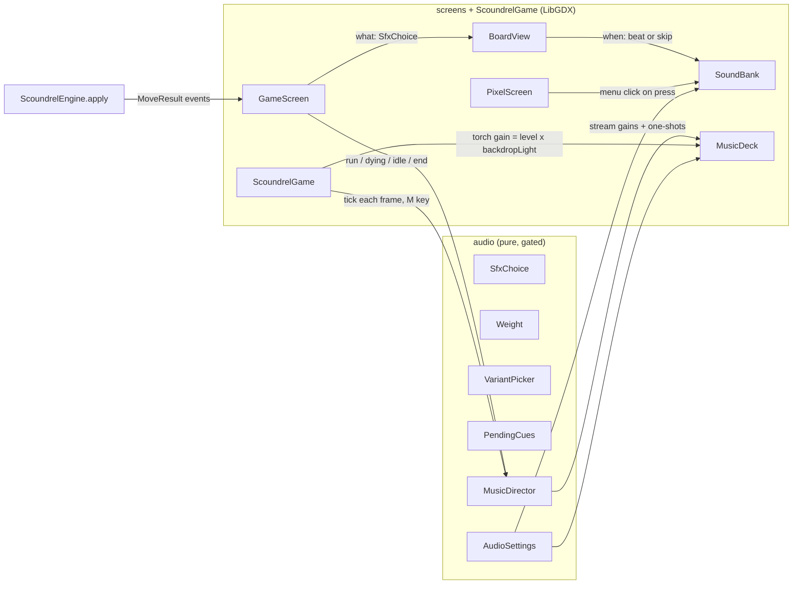

# Audio Implementation Plan

> ## 🟡 Status: in progress; Tasks 1–3 done (2026-09-24)
>
> The design was locked in the 2026-09-23 interview. This plan and all nine planning decisions
> were approved on 2026-09-24. All work is on the **`audio` branch**. **Next: Task 4.**
> The pure `audio` package exists and is tested, but nothing plays yet. Read **Deviations**
> before Tasks 5–6: several notes there are instructions for them.
>
> Update this banner, the **Roadmap** checkboxes and the **Session log** in the same commit as
> the work they describe. When the work is finished, turn the banner into an "Executed" note like
> [`2026-08-13-code-health-r1-r6.md`](2026-08-13-code-health-r1-r6.md), listing every step that
> did not survive contact with the code.

## Resuming in a new session

1. **`git switch audio`.** The work lives on that branch, not on `main`. Then read this file top
   to bottom. Every decision is here; the conversation that produced it is gone.
2. **Find the first unchecked item in the Roadmap.**
3. **Don't trust the checkboxes; verify them.** Run
   `git log --oneline -- audio-source assets/audio core/src/main/java/com/tomer/scoundrel/audio`
   to see what was actually committed, then open the files. The line numbers under **Code
   anchors** were correct at `51b4da8` and will drift.
4. **Follow `CLAUDE.md`**: tests first for pure logic, commit each working piece, and verify
   GL work with screenshots or logs. Read `core/src/main/java/com/tomer/scoundrel/screens/CLAUDE.md`
   before touching a screen.
5. **When a step turns out wrong in the code**, do the right thing and record it under
   **Deviations**. Don't follow a wrong step silently.

## Roadmap

- [x] **Design interview**: three rounds plus the SFX trim (2026-09-23)
- [x] **Plan approved**, nine planning decisions locked (2026-09-24)
- [x] **This file** (2026-09-24)
- [x] **Task 1:** Tooling, an OGG encoder (2026-09-24: soundfile 0.14.0)
- [x] **Task 2:** The `docs/audio.md` reference (2026-09-24)
- [x] **Task 3:** The pure `audio` package, tests first (2026-09-24, `e49a6bb`…`b8e7f74`)
- [ ] **Task 4:** Synthesize the 29 sound effects, plus `AudioAssetsTest` → 🎧 **Listening round 1**
- [ ] **Task 5:** `SoundBank`, the timing hooks, the menu click, sounds firing on skip → 🎧 **Listening round 2**
- [ ] **Task 6:** Music, the torch loop and `MusicDirector` → 🎧 **Listening round 3**
- [ ] **Task 7:** Controls: title plates, M, saved settings, pause when minimised, no-device check
- [ ] **Task 8:** Docs sync and memory
- [ ] **Later, open-ended:** replace weak placeholders from approved sources (see **Sourcing ledger**)
- **Not in scope:** a release. That's a separate decision (version bump, `CHANGELOG`, tag, per
  `CLAUDE.md`).

**Goal:** Give Scoundrel sound effects, music and ambience that fit a fast-paced, torchlit
pixel game. There is one sound per moment, each plays on its animation's beat, and the game
never crashes because of audio. It ships first as placeholders Claude synthesizes, so the whole
game is wired and timed before any sound is sourced.

**Architecture:** A new pure `audio` package decides *what* plays: which file, how loud, and
which music track at what volume. It observes `model`/`rules` from outside, the way
`achievements` does. The `screens` layer decides *when*: `BoardView` fires each sound on its
animation's beat, or at once when the animation is skipped. A LibGDX-side `SoundBank` and
`MusicDeck` play the files. `ScoundrelGame` runs the music every frame so it survives screen
changes. The sounds are rendered offline by Python scripts in `audio-source/` and committed
under `assets/audio/`.

**Tech stack:** Java 21, LibGDX 1.14.2 (LWJGL3 / OpenAL), JUnit 5 + JaCoCo. For offline
synthesis: Python 3.14 + numpy, plus an OGG encoder (Task 1).

## Global constraints

Every task's requirements implicitly include these.

- **Purity.** No `com.badlogic.gdx.*` in `model`, `rules`, `runs`, `achievements`, `tutorial`
  **or `audio`**. Verify: `grep -rl 'com.badlogic.gdx' core/src/main/java/com/tomer/scoundrel/{model,rules,runs,achievements,tutorial,audio}`
  must print nothing.
- **Imports run one way.** `model`/`rules` never import `audio`. `audio` may import
  `model`/`rules` and nothing else of ours (not `runs`, `achievements`, `tutorial` or `screens`).
  Timing numbers that live in `screens` are passed in, not imported.
- **`./gradlew core:check` is green before every commit.** Baseline measured 2026-09-24: 601
  `@Test` annotations in 76 test classes (by grep). The coverage gate is 90% of lines and 75%
  of branches per pure package. `CoverageGateTest` fails until `audio` is added to the gate.
- **Tests first (red-green)** for all pure logic. GL work is verified by screenshot or by the
  in-game sound log (`CLAUDE.md`).
- **One commit per working piece**, with a lowercase conventional prefix matching `git log`.
- **Audio never crashes the game.** Every load and play is guarded. A missing or bad file means
  silence plus one log line.
- **Sound follows the picture.** A sound fires on its animation's beat, never when the move is
  applied, and a skipped animation fires its pending sound at once.
- **The screen rules don't change.** Screens still cut. Audio crossfades are a deliberate
  exception, like the smooth torch backdrop.
- **The sound list is closed.** The user's call: in a fast-paced game there is one sound per
  moment. Push back on any new sound that would coincide with an existing one.
- **Claude can't hear.** Verify with measurements and the sound log; the user is the ear at
  each listening round. Never claim how something *sounds*.
- **Never hand-edit `assets/assets.txt`.** Everything in `assets/` ships, so audition pages,
  scripts and source files stay out of it.

## Locked design (interview, 2026-09-23)

### Direction and sourcing

- **Overall sound: crunchy lo-fi.** Grounded sounds (thuds, steel, glass, fire) given a retro
  edge through sample-rate reduction, mild bit-crushing and a low-pass filter. **Not** pure
  chiptune.
- **Sourcing: placeholder-first.** Claude synthesizes everything; the user listens; weak sounds
  get replaced.
- **Approved replacement sources:**
  - CC0 (free, no credit).
  - CC-BY: credit in `assets/audio/CREDITS.txt`, created with the first CC-BY file.
  - AI-generated, disclosed. Check the tool's current commercial terms on the day it's used,
    and disclose it alongside the Claude collaboration in portfolio material.
  - Paid packs or a commission.
  - **Non-commercial (NC) licences are excluded**, so a future sale never forces a re-source.

### Music: two tracks and two cues

- **Run track:** slow and brooding. All three modes (Standard, Relentless, Frail) share it.
- **Menu track:** the same theme, stripped back.
- **Win cue and death cue:** short one-shots.
- **The tutorial** sounds like a normal run.

### Sound effects: one per moment

| Sound | Weighted by | Moment |
|---|---|---|
| Menu click | — | Title, mode select, ledger, trophies, end-of-run buttons |
| Card flip | — | Each card dealt (neutral; no boss warning, no per-type sound) |
| Avoid sweep | — | Room avoided |
| Equip | weapon value | Weapon taken |
| Weapon kill | weapon (blade) + damage let through (thud) | Monster killed with a weapon |
| Bare-handed strike | monster value | Monster fought bare-handed |
| Drink | potion value | Potion taken, **including at full health** (heals 0, still a drink) |
| Spill | — | Wasted second potion in a room |
| Achievement chime | — | When TROPHIES UNLOCKED appears on the end panel |
| Torch crackle (loop) | — | Every screen, quietly under the music |

**Cut** (each would coincide with a sound already on the list):
- Button sounds during a run.
- Weapon wearing down (it fires with every weapon kill).
- The old weapon being discarded (it happens inside equip).
- A separate heal sound (it would sit on the drink).
- A separate hurt sound (damage is folded into the hit).

### Weighting

- **Each sound is one recipe, built at three weights** (light / medium / heavy) as separate
  files. A small pitch change by exact value separates cards within a weight. Only frequent
  sounds get versions, chosen at random and never the same one twice in a row. Rare moments
  (spill, chime, cues) sound identical every time on purpose, so they're recognisable.
- **The weights:**
  - Weapons and potions: 2–4 light, 5–7 medium, 8–10 heavy.
  - Monsters: 2–5 light, 6–10 medium, 11–14 heavy.
  - Damage let through on a weapon kill: 0 = none, 1–4 light, 5+ heavy.
- **Weight comes from value only.** No edged/blunt weapon split, no creature body types or
  voices, and clubs and spades sound the same.
- **Damage folds into the hit.** A weapon kill that costs no health sounds crisp; one that lets
  damage through lands heavier.

### Behaviour

- **Menus to run:** music crossfades while the picture still cuts. The menu track does **not**
  restart when you move between menu screens.
- **Torch crackle** plays on every screen and follows the torch's brightness.
- **Death:** the run music and the crackle die with the torch as it goes out. A beat of silence
  follows, then the death cue as YOU DIED grows in.
- **Skipping:** a skipped animation fires its pending sound at once, so every action sounds
  exactly once. This matters because every click during an animation skips it, so fast play
  skips constantly.

### Controls and defaults

- **Two plates on the title, MUSIC and SOUND**, each cycling through levels. M mutes everything
  from any screen.
- **Levels are saved in `~/.scoundrel/audio.settings`** and survive the full progress reset
  (they're settings, not progress).
- **First launch:** both on, with music below effects.
- **Audio pauses when the window is minimised.** With no audio device the game runs silently
  and never crashes.
- **A new best score gets no cue of its own.**

## Planning decisions (approved 2026-09-24)

1. **Weapon kill** = a *blade* sound weighted by the weapon, plus a *thud* only when damage gets
   through (1–4 light, 5+ heavy). A clean kill is blade only. The monster's value is heard
   only through the damage it does.
2. **Deal:** one flip per card as it lands. A skipped deal plays a **single** flip, not four
   at once.
3. **The menu click plays on press**, when the plate visibly sinks, not on release.
4. **The tutorial callout's NEXT and SKIP buttons are silent.** They're pressed during a run.
   The end-of-run panel's buttons do click.
5. **Win:** the run music fades out when the last animation finishes, then the win cue plays,
   then the achievement chime (if any) after the cue.
6. **The end-of-run panel is quiet**: only the torch crackle. The menu track returns when you go
   to a menu screen; the run track restarts on NEW GAME.
7. **M during a run** shows SOUND OFF / SOUND ON in the event feed.
8. **Levels:** OFF plus 3 steps (step 3 = 0 dB, 2 = −6 dB, 1 = −12 dB). On first launch music is
   at step 2 and sound at step 3.
9. **Placeholder music:**
   - D minor, about 64 BPM, loops of about 60–90 s.
   - Run track: a drone, a sparse plucked melody (Karplus-Strong string synthesis) and a soft
     low pulse.
   - Menu track: the same melody over the drone only.
   - Win cue: ends on a major chord (a Picardy third).
   - Death cue: sinks and goes out.

## Timing: when each sound fires

Effects run at 12 fps (one frame = 83 ms). Times are from the start of the effect. The killing
blow runs at half speed (`BoardView.effectRate` = 0.5), so its beats land twice as late. Beats
should be computed on the effect's own clock rather than hard-coded.

| Sound | Beat | Source of truth |
|---|---|---|
| Bare-handed strike | 0 ms. Two blows 83 ms apart, both in one file | `Barehanded.HIT_FRAMES` |
| Weapon kill (blade + thud) | 167 ms, as the blade lands | `WeaponKill.SLASH_START` |
| Equip | 250 ms, landing on the rail | `CardFlight.EQUIP` (3 hops × 1 frame) |
| Avoid sweep | 0 ms. The room is gone at 250 ms | `CardFlight.AVOID` |
| Drink | 417 ms, the pour (the existing `onPour` hook) | `PotionDrink.POUR_START` |
| Spill | 250 ms | `PotionSpill.SPILL_START` |
| Deal flips | The deal starts after the effect ends. Card *n* lands at 250 / 333 / 417 / 500 ms | `CardFlight.dealTo` (1-frame stagger, 3 hops) |
| Menu click | On press, as the plate sinks | `PressGesture.press` |
| Death: music and crackle fade | 1.25 s → 2.75 s (the torch going out) | `DeathCinematic.DITHER_START` / `DITHER_END` |
| Death cue | ≈ 3.42 s, as YOU DIED grows in | `DeathCinematic.TITLE_START` |
| Death, clicked through | Quick fade; the cue plays now if it hasn't yet | `GameScreen.settleEnd` |
| Win cue | When the board goes idle after the winning move | `BoardView.isPlaying()` |
| Chime | Death: when the end panel appears. Win: after the win cue | `GameScreen.newlyUnlocked` |

## Asset contract

The file names are the contract, like the sprite region names. Unweighted sounds are named
`<sound>_<version>`; weighted sounds are `<sound>_<weight>_<version>`, where weight is `light`,
`medium` or `heavy`. The Java side derives the expected set from the same code that names the
files, and `AudioAssetsTest` checks the folder matches it exactly.

**Sound effects**, in `assets/audio/sfx/`. WAV, 16-bit PCM, mono, 44.1 kHz. **29 files:**

| Sound | Files | Count |
|---|---|---|
| click | `click_1` | 1 |
| flip | `flip_1` … `flip_3` | 3 |
| sweep | `sweep_1` | 1 |
| equip | `equip_{light,medium,heavy}_1` | 3 |
| blade | `blade_{light,medium,heavy}_{1,2}` | 6 |
| thud | `thud_{light,heavy}_{1,2}` | 4 |
| fist | `fist_{light,medium,heavy}_{1,2}` | 6 |
| drink | `drink_{light,medium,heavy}_1` | 3 |
| spill | `spill_1` | 1 |
| chime | `chime_1` | 1 |

**Streamed audio**, OGG Vorbis at 44.1 kHz. Music is stereo; the torch is mono. **5 files:**
`assets/audio/music/menu.ogg`, `run.ogg`, `win.ogg`, `death.ogg`, and
`assets/audio/ambience/torch.ogg`.

**Total: 34 files.** These are design counts; check the folder for the real state.

**Starting mix targets** (to be tuned by ear in round 1 and recorded here once set):
- Every file peaks at or below −1 dBFS.
- Every sound effect has at most 5 ms of silence at the start, so its attack lands on the beat.
- Every file's tail decays to silence.
- There's no DC offset.
- Sound effects are matched on RMS loudness within a category.
- Music is normalised quieter than the sound effects.

## Architecture

**`audio` (pure, new, added to the coverage gate):**

| Class | What it does |
|---|---|
| `Weight` | Sorts a value into light / medium / heavy: `ofWeapon`, `ofPotion`, `ofMonster`, and `ofDamageThrough` (none for 0). |
| `SfxChoice` | Turns a moment into file names plus a pitch, e.g. `equip(weapon)`, `weaponKill(weaponValue, damage)` → blade (+ thud), `strike(monster)`, `drink(potion)`, `spill()`, `sweep()`, `flip()`, `click()`, `chime()`. Maps every `GameEvent` type, including those that make no sound (`WeaponDegraded`, `RoomDealt`, `GameWon`, `GameLost`). Owns the list of expected files. |
| `VariantPicker` | A seeded random choice of version that never repeats back to back. |
| `PendingCues` | Queues sounds for their beats. Reports what's due, and on skip flushes everything pending exactly once, collapsing pending flips into one. |
| `MusicDirector` | Given the place (menu or run), the death timings (passed in from `DeathCinematic`), click-through, board idle and elapsed time, it produces each track's volume and the one-shot triggers (win cue, death cue, chime). |
| `AudioSettings` | Music and sound levels (0–3), mute, the level-to-gain mapping, cycling, defaults, and the tolerant `v=1` key=value store in `~/.scoundrel/audio.settings` (following `TutorialFlag`). |

**`screens` (LibGDX):**

| Class | What it does |
|---|---|
| `Beats` | *Pure helper*, unit-tested. Reads each effect's beat times from the effect classes, so moving an animation moves its sound with it. |
| `SoundBank` | Loads the sound effects, plays them with volume × setting × pitch, caps how many copies of each sound play at once (the oldest stops), guards everything, and writes the optional sound log. |
| `MusicDeck` | The streamed tracks and the torch loop, with volumes set each frame from `MusicDirector`. |

`ScoundrelGame` owns `SoundBank`, `MusicDeck`, `MusicDirector` and `AudioSettings`, like `Theme`
and `Sprites`. It checks the M key beside F11 and pauses and resumes the music on minimise.

**The sound log:** with `-Dscoundrel.audio.log=true`, every sound and one-shot is logged with a
millisecond timestamp through `Gdx.app.log`. This is how GL-side timing gets verified.

## Code anchors (correct at `51b4da8`; line numbers drift)

- `screens/BoardView.java:141–146`: the pour fires inside `update()`. `:235–245`: `skip()` fires
  a pending pour. **Every sound copies this pattern.** Also: `:33` the `Kind` enum, `:68`
  `effectRate` (0.5 for the killing blow), `:160–170` `effectLength`, `:186–200` `rising()`
  (which cards are still dealing in), `:218` `isPlaying()`, `:347–367` `start(...)`.
- `screens/GameScreen.java`:
  - `:185–186`: any press during an animation calls `board.skip()`.
  - `:971` `applyMove`: events go to the feed, then `playEffect`, then the death starts.
  - `:1028` `playEffect`: the switch over `ResolveEffect`.
  - `:98` `weaponBeforeMove`: the weapon's value for the blade sound.
  - `:305` `backdropLight()`: returns `DeathCinematic.torchLight` during a death. The torch
    crackle's volume comes from here.
  - `:472` `settleEnd()`: reached by clicking through (`:159–161`) or when the death finishes
    (`:352–357`).
  - `:531` `syncBoard()`: shows the end panel. **A win has no cinematic**: the panel appears
    immediately while the last animation is still playing.
  - `:928` `finishRun()`: sets `newlyUnlocked`, the condition for the chime. `:650`
    `drawUnlocked`.
  - `:902` `startRun()`.
- `screens/DeathCinematic.java:26–76`, in frames at 12 fps: flare 2, shake 3, settle 10, torch
  going out 18 (`DITHER_START` 1.25 s → `DITHER_END` 2.75 s), ticker hold 6, black 2.
  `TITLE_START` ≈ 3.42 s; `TOTAL` ≈ 5.67 s.
- `screens/PressGesture.java`: `:53` `press`, `:91` `cancel`, `:106` `advance`. A menu press
  sinks the plate, the release arms the action, and it fires after `MIN_SINK` = 0.06 s.
  `PixelScreen.java:47` owns the gesture; `:119` `backdropLight`; `:132` `keyPressed`.
- `ScoundrelGame.java`:
  - `:58–75`: F11 and F9 are checked in `render()`; **M goes here**. M was unbound at `51b4da8`.
  - `:46–56`: `create()` builds the `~/.scoundrel` stores.
  - `:133–135`: `eraseAllProgress` calls `Progress.eraseAll(runLog, achievements, tutorialFlag)`.
    Audio settings are deliberately not passed.
- `tutorial/TutorialFlag.java`: the tolerant file-store pattern to copy.
- `screens/TitleScreen.java:73–76`: the four menu entries. `ScreenArt.java:68–70, 103`:
  `BUTTON_W` 268, `BUTTON_H` 46, `BUTTON_PITCH` 56, `BUTTONS_Y` 326.
- `core/build.gradle:121–141`: the coverage gate's list of included packages. `:91–111`: how to
  declare test inputs that live outside the module; copy it for `assets/audio`, or edits won't
  re-run `AudioAssetsTest`.
- `lwjgl3/.../Lwjgl3Launcher.java`: no audio settings today.
- **LibGDX 1.14.2, checked in the jars:**
  - With no audio device, the backend logs "Couldn't initialize audio, disabling audio" and
    switches to a silent mock.
  - `Lwjgl3ApplicationConfiguration` has `setPauseWhenMinimized`, `setPauseWhenLostFocus`,
    `disableAudio` and `setAudioConfig`.
  - `Sound.play(volume, pitch, pan)` exists, and so do `Music.setVolume`, `setLooping`,
    `setPosition` and `setOnCompletionListener`.
- **This machine:** Python 3.14.6 with numpy 2.5.3. soundfile 0.14.0 was added in Task 1
  (2026-09-24). **Not installed** (checked 2026-09-23): scipy, ffmpeg, sox, oggenc.

## File structure

**Created**

| File | Responsibility |
|---|---|
| `docs/audio.md` | The lasting reference for what ships: sounds, file contract, timing, levels, sourcing, how to regenerate |
| `core/src/main/java/com/tomer/scoundrel/audio/*.java` | `Weight`, `SfxChoice`, `VariantPicker`, `PendingCues`, `MusicDirector`, `AudioSettings` |
| `core/src/test/java/com/tomer/scoundrel/audio/*Test.java` | One test class per class above, plus `AudioAssetsTest` |
| `core/src/main/java/com/tomer/scoundrel/screens/{Beats,SoundBank,MusicDeck}.java` | Beat times (pure), sound playback, streamed playback |
| `core/src/test/java/com/tomer/scoundrel/screens/BeatsTest.java` | Pins each beat to the effect constant it comes from |
| `audio-source/{README.md,requirements.txt,synth.py,recipes.py,music.py,render.py,check.py}` | Offline synthesis, rendering and measurement |
| `audio-source/build/` (gitignored) | The audition page and scratch renders; never under `assets/` |
| `assets/audio/sfx/*.wav`, `assets/audio/music/*.ogg`, `assets/audio/ambience/torch.ogg` | The 34 rendered files, committed |

**Modified:**
- `ScoundrelGame.java`
- `screens/BoardView.java`, `GameScreen.java`, `PixelScreen.java`, `TitleScreen.java`,
  `ScreenArt.java`
- `lwjgl3/.../Lwjgl3Launcher.java`, only if the minimise pause needs it
- `core/build.gradle`: the coverage gate and the `AudioAssetsTest` inputs
- `.gitignore`: `audio-source/build/`
- `CLAUDE.md`, `docs/ui.md`, `README.md`, `CHANGELOG.md`, `screens/CLAUDE.md`

**Not touched:** `model`, `rules`, `runs`, `achievements`, `tutorial`. The engine and its
events are already sufficient.

---

## Task 1: Tooling, an OGG encoder

- [x] **Ask the user before installing anything.** The user asked for soundfile.
- [x] Install: `python -m pip install --user soundfile`. It bundles libsndfile with Vorbis support.
- [x] Check: `python -c "import soundfile as sf; print(sf.__version__, sf.available_formats().get('OGG'))"`.
- [x] Round trip, in the scratchpad: write a 1 s sine to OGG/Vorbis, read it back, and compare
      length and RMS.
- [x] ~~**Fallback** if there's no build for Python 3.14~~. Not needed: the wheel installed.
- [x] Record the chosen encoder and its version in the **Session log**.

**Verify:** an OGG written by Python decodes to the right length. Nothing in the repo changes
yet except `audio-source/requirements.txt`.

## Task 2: The `docs/audio.md` reference

- [x] Write `docs/audio.md` in the style of `docs/design.md` and `docs/ui.md`: the sound list,
      file contract, timing table, levels and mix, sourcing rules and ledger, and how to
      regenerate. Sections for unbuilt parts say **planned**, so the doc never claims what
      hasn't shipped (the drift `CLAUDE.md` warns about).
- [x] This plan stays the record of intent. `docs/audio.md` becomes the record of what ships,
      and each later task updates it.

**Verify:** every fact in it is checked against the code or files when it's written.

## Task 3: The pure `audio` package (tests first)

For **each** class, in the order `Weight` → `VariantPicker` → `SfxChoice` → `PendingCues` →
`AudioSettings` → `MusicDirector`:

- [x] Write the failing test.
- [x] Run it: `./gradlew core:test --tests '*<Class>Test'`. Confirm it **fails for the right
      reason**, and use `core:cleanTest` if the task could be skipped as up to date.
- [x] Implement until green.
- [x] Commit.

Also:
- [x] Add `'com.tomer.scoundrel.audio'` to the coverage gate in `core/build.gradle`.
      `CoverageGateTest` fails until this is done.
- [x] Test cases that must exist:
  - [x] Weight boundaries for all four scales: 4/5, 7/8 and 5/6, 10/11, and damage 0/1, 4/5.
  - [x] No version repeats back to back, every version is reachable, and a fixed seed gives a
        fixed sequence.
  - [x] Every `GameEvent` type has a defined sound choice (none for `WeaponDegraded`,
        `RoomDealt`, `GameWon`, `GameLost`).
  - [x] A `PotionUsed` with 0 healed gives the drink sound.
  - [x] A clean weapon kill gives the blade only; a costly one gives the blade plus a thud of
        the right weight.
  - [x] The expected-file list is exactly the 29 names in the asset contract (`SoundTest` spells them out by hand).
  - [x] `PendingCues`: fires once on its beat; skip flushes all pending once; pending flips
        collapse into one.
  - [x] `AudioSettings`: defaults (music 2, sound 3, unmuted), cycling, gains by level (0 = off,
        1 = −12 dB, 2 = −6 dB, 3 = 0 dB), a save/load round trip, and a corrupt or missing file falling back to defaults.
  - [x] The progress reset leaves the settings file alone (a test in the root package, next to
        `Progress`).
  - [x] `MusicDirector`:
    - Menu music continues across menu screens without restarting.
    - Menu ↔ run crossfade.
    - Death: the fade over the window passed in, the cue exactly once at the time passed in,
      and click-through fires the cue now and never twice.
    - Win: waits for board idle, then the cue, then the chime after the cue.
    - End panel: silence.
    - NEW GAME restarts the run track; MAIN MENU brings back the menu track.

**Verify:**
- `./gradlew core:cleanTest core:check` is green, with `audio` gated.
- The purity grep including `audio` prints nothing.
- The `@Test` count has risen from 601 (measure it).

## Task 4: Synthesize the 29 sound effects, plus `AudioAssetsTest`

- [ ] **`synth.py` primitives** (numpy only; write the filters by hand, no scipy):
  - Oscillators, noise and envelopes.
  - One-pole and biquad filters.
  - Karplus-Strong (plucked string).
  - Modal metal: inharmonic partials that decay.
  - Soft clipping.
  - The lo-fi stage: sample-rate reduction, bit-crushing and a low-pass.
- [ ] **`recipes.py`:** one recipe per sound (flip, sweep, equip, blade, thud, fist, drink,
      spill, click, chime), with its weights and versions and **fixed seeds**. Rendering is
      deterministic: the same seed gives a byte-identical WAV.
- [ ] **`render.py`** writes `assets/audio/sfx/*.wav`.
- [ ] **`check.py`** checks peak, leading silence, silent tail, DC offset, a per-sound maximum
      length (flips must stay short, since cards land 83 ms apart) and per-category RMS
      matching. It exits non-zero on failure.
- [ ] **`AudioAssetsTest`** (JUnit, using the JDK's `javax.sound.sampled`, no LibGDX):
  - The folder matches `SfxChoice`'s expected list exactly: none missing, **none extra**.
  - Every file has the right format.
  - Every file peaks at or below −1 dBFS.
  - Every file has at most 5 ms of silence at the start.
  - Declare `assets/audio` as a test input in `core/build.gradle`.
- [ ] **The audition page:** `audio-source/build/audition.html` (gitignored), grouped by sound
      and weight, to open locally.
- [ ] Commit the scripts and rendered files.
- [ ] 🎧 **Listening round 1.** Ask the user, for each sound: does it fit crunchy lo-fi, can the
      weights be told apart, is anything grating on repeat, and is the loudness even?
      Iterate and record the outcome in the **Session log**.

**Verify:** `check.py` passes, `AudioAssetsTest` is green, and the user signs off round 1 or
lists changes.

## Task 5: `SoundBank`, the timing hooks, the menu click, sounds firing on skip

- [ ] `Beats` (pure) + `BeatsTest`, tests first. Every beat in the timing table comes from its
      effect constant.
- [ ] `SoundBank`:
  - Load all 29 through `Gdx.audio.newSound(Gdx.files.internal("audio/sfx/..."))`, guarded.
  - Play with volume × setting × pitch.
  - Cap copies per sound, with the oldest stopping.
  - The sound log behind `-Dscoundrel.audio.log=true`.
  - Owned and disposed by `ScoundrelGame`.
- [ ] `BoardView`:
  - Each effect queues its sound in `PendingCues` on the effect's own clock (so it
    automatically follows the half-speed killing blow).
  - `update()` fires whatever is due.
  - `skip()` flushes pending sounds.
  - Deal flips fire as each card lands, from the `rising()` logic.
- [ ] `GameScreen` passes `SfxChoice` results into `BoardView`, with the weapon value from
      `weaponBeforeMove` and damage from the events.
- [ ] `PixelScreen` plays the menu click when a press lands on a target. The end panel clicks;
      the tutorial callout does not (decision 4).
- [ ] Confirm the F9 animation lab (`SpriteLab`) plays the same sounds through the same
      `BoardView`.
- [ ] 🎧 **Listening round 2**: a real run plus the F9 lab. Does each sound land on its moment,
      and does fast play stay clean?

**Verify:**
- Drive a run with the `run-scoundrel` skill and the sound log on. Every action is logged
  exactly once, in order, with beat offsets matching the timing table to within one render
  frame.
- Fast clicking still logs every action once, and a skipped deal logs one flip.
- No visual change.

## Task 6: Music, the torch loop and `MusicDirector`

- [ ] **`music.py`**: note data and rendering for `menu`, `run`, `win` and `death` (decision 9),
      plus the `torch` crackle loop. Write OGG through the Task 1 encoder.
- [ ] **`check.py` additions:** loop-seam continuity (sample jump and spectral click at the
      wrap), loudness relative to the sound effects, duration, and an OGG round trip. Measure the peak
      on the **decoded** OGG: Vorbis overshoots by about 0.2 dB (Task 1).
- [ ] **`MusicDeck`:** streamed playback, guarded, with volumes set each frame.
- [ ] **`ScoundrelGame`:**
  - Tick `MusicDirector` every frame.
  - Menu screens report MENU and `GameScreen` reports RUN. That needs a small accessor on
    `PixelScreen`; `SpriteLab` defaults to MENU with full torch.
  - The torch volume is level × the current screen's `backdropLight()`.
- [ ] **`GameScreen`:**
  - Pass the death timing (`DeathCinematic.DITHER_START`, `DITHER_END`, `TITLE_START`) to the
    director, along with click-through.
  - Report board idle for the win.
  - Report the chime condition (`newlyUnlocked` not empty).
- [ ] 🎧 **Listening round 3**: mood, the loop seams by ear, the crossfades, and the death and
      win sequences.

**Verify:**
- The sound log shows the fade window at 1.25–2.75 s, the death cue once at about 3.42 s
  (within one frame), and click-through firing the cue once.
- Win: cue after idle, then the chime.
- Going title → ledger → trophies → title logs no menu-track restart.
- `check.py` passes the seam checks.

## Task 7: Controls

- [ ] **Title:** MUSIC and SOUND plates below the four menu buttons, each showing its level
      (OFF plus 3 pips drawn as whole-pixel rectangles).
  - They cycle on release, with the usual menu behaviour, and play the click at the new sound
    level.
  - Put the geometry in `ScreenArt`. Any new colour goes into `UiPalette` with a comment.
  - Pure layout or label logic goes in a tested helper.
- [ ] **M:** checked in `ScoundrelGame.render()` beside F11. Toggles mute on any screen, saves
      the setting, and shows SOUND OFF / ON in the feed during a run (decision 7).
- [ ] **Settings:** loaded in `create()` and saved on change. First launch uses the defaults.
- [ ] **Minimise:** `ScoundrelGame.pause()`/`resume()` pause and resume the streams. Verify from
      the log inside the running game, not by reasoning about the backend.
- [ ] **No device:** a launcher system property that sets `disableAudio(true)`, to simulate one.
- [ ] **Screenshot the title** and get the user's approval. The mock has no plates, so placement
      is a design sign-off.

**Verify:**
- The screenshot is approved.
- Settings survive a relaunch.
- The log shows the music paused and resumed around a minimise.
- A run completes with audio disabled, with no `crash.log` entry.

## Task 8: Docs sync and memory

- [ ] **`CLAUDE.md`:**
  - Add `audio` to the package list.
  - Add `audio` to the purity grep line.
  - Add the regenerate-audio command.
  - Add `docs/audio.md` to References.
  - Keep the file under 200 lines.
- [ ] **`docs/ui.md`:** the title plates, the M key and the audio behaviour.
- [ ] **`screens/CLAUDE.md`:** "sounds fire on beats via `Beats`; never on apply".
- [ ] **`README.md`** features and a **`CHANGELOG.md`** Unreleased entry.
- [ ] **`docs/audio.md`:** switch every *planned* marker to what actually shipped.
- [ ] **Memory:** update `audio-direction.md` to *built*.
- [ ] **This file:** the banner becomes "Executed", with the deviations.

**Verify:**
- `./gradlew core:cleanTest core:check`, then measure the test count and per-package coverage
  from the fresh report.
- The purity grep prints nothing.
- Every changed doc sentence is re-checked against the code.

---

## Listening rounds

| Round | After | What the user judges |
|---|---|---|
| 1 | Task 4 | Each sound on its own (audition page): fit, weight separation, fatigue on repeat, even loudness |
| 2 | Task 5 | In context (a real run + the F9 lab): sounds on their beats, fast play clean, nothing stacking |
| 3 | Task 6 | Music mood, loop seams, crossfades, death and win sequences, torch under the music |

Record each round's verdict and the changes it asked for in the **Session log**.

## Sourcing ledger

Status goes *planned* → *placeholder* → *approved* or *replaced*. A replacement records its
source, author and licence:
- **CC-BY** also goes in `assets/audio/CREDITS.txt`.
- **AI** records the tool, the plan and the date its terms were checked.
- **NC** is never allowed.

| Files | Status | Source | Licence | Notes |
|---|---|---|---|---|
| `sfx/click_1` | planned | synth | ours | |
| `sfx/flip_1–3` | planned | synth | ours | |
| `sfx/sweep_1` | planned | synth | ours | |
| `sfx/equip_*` (3) | planned | synth | ours | |
| `sfx/blade_*` (6) | planned | synth | ours | |
| `sfx/thud_*` (4) | planned | synth | ours | |
| `sfx/fist_*` (6) | planned | synth | ours | |
| `sfx/drink_*` (3) | planned | synth | ours | |
| `sfx/spill_1` | planned | synth | ours | |
| `sfx/chime_1` | planned | synth | ours | |
| `ambience/torch` | planned | synth | ours | |
| `music/menu` | planned | synth | ours | Most likely to be replaced |
| `music/run` | planned | synth | ours | Most likely to be replaced |
| `music/win` | planned | synth | ours | |
| `music/death` | planned | synth | ours | |

## Risks

- **Designing and composing without hearing.** The bar for a placeholder is: it matches its
  description, loops cleanly and has even loudness. Expect replacements, most likely the music.
- ~~**Python 3.14 is new.** `soundfile` may have no build for it.~~ Resolved in Task 1:
  soundfile 0.14.0 installed and round-trips OGG/Vorbis.
- **OGG loop seams in LibGDX's music playback:** the seam can be measured in the file but not
  in the running game. The user confirms it by ear in round 3.
- **Fast play stacking:** the per-sound copy caps and short effects are the defence. Round 2
  judges it.
- **Anything under `assets/` ships**, so audition and scratch files stay in
  `audio-source/build/`.

## Deviations

Record each step that didn't survive contact with the code, and what was done instead.

**Task 3 (2026-09-24):**

- **More classes than planned, same responsibilities:**
  - `Weight` is a public enum (light / medium / heavy). The bands and the pitch nudge moved to
    a package-private `Scale` (WEAPON, POTION, MONSTER, DAMAGE), so a weight and its pitch
    can't disagree.
  - **`Sound`** is new: the closed list of ten effects and the 29-file contract
    (`Sound.allFiles()`). It replaces "`SfxChoice` owns the list of expected files". A
    weighted sound takes its weights from its `Scale`, which is why the thud has no medium.
  - **`Sfx`** is new: one chosen playback (sound, file, pitch, volume), with `path()` giving
    `audio/sfx/<file>.wav`.
  - `AudioSettings` is the record. The file I/O is a separate **`AudioSettingsStore`**, named
    like `AchievementStore`.
- **Frequent sounds vary per play:** sounds with more than one version (flip, blade, thud,
  fist) get ±2% pitch and up to 10% quieter, never louder. The interview promised this
  alongside the versions, but the plan's text had dropped it. Single-version sounds stay exact.
  Both amounts are starting values for the listening rounds (`SfxChoice.PITCH_JITTER`,
  `VOLUME_JITTER`, and `Scale.NUDGE` = ±4%).
- **Changing a MUSIC or SOUND level un-mutes.** The plan didn't say; turning a volume is a
  request to hear it.
- **The chime waits for the end panel *and* for this run's cue to finish.** This refines "death:
  chime when the end panel appears". Clicking through a death puts the panel up at once, so the
  old rule would have put the chime on top of the death cue. For a win it's unchanged
  (decision 5). `docs/audio.md` is updated to match.
- **The first Task 3 commit used a `feat(audio):` prefix.** The repo has no scoped prefixes; the
  rest use `feat:`.

**Instructions for Tasks 5–6, from Task 3's API:**

- **`BoardView`** must call `PendingCues.due(effectLength)` when an effect ends naturally, so a
  beat at the very end (equip lands at exactly the effect's length) still fires in that frame.
  Before starting a new effect with sounds still pending (possible in the F9 lab, which doesn't
  skip), it must `flush()`.
- **The one-shot player** must report `MusicDirector.cueEnded(cue)` from the music's
  completion listener, and **immediately if the cue failed to load**. Otherwise the chime
  never plays.
- **`GameScreen`** passes `DeathCinematic.DITHER_START`, `DITHER_END` and `TITLE_START` to
  `dying(...)`, calls `settled()` from `settleEnd()`, `won()` on a win, and
  `trophiesUnlocked()` when `newlyUnlocked` isn't empty. `tick(delta, boardIdle)` takes
  `!board.isPlaying()`.
- **Known edge left alone:** a death cue from one run that ends during *another* run's death
  cue would count as the second one ending. That needs a player to die twice within a cue's
  length; if it ever matters, stop one-shot cues on `Restart(RUN)`.

## Session log

- **2026-09-23:** Design interview. Round 1: crunchy lo-fi, menu + run + cues,
  placeholder-first; the SFX scope was trimmed from about 45 sounds to one per moment. Round 2:
  damage folded into the hit, weight by value only, a neutral deal flip; title plates + M,
  crossfading music with cutting screens, music dying with the torch, skipped animations firing
  their sounds at once. Round 3: a slow, brooding run track; a stripped-back menu track on the
  same theme; torch crackle on every screen; sources CC0 / CC-BY / AI (disclosed) / paid. The
  research found no existing audio; the engine's events and `BoardView`'s pour hook are the
  seams.
- **2026-09-24:** Plan approved and the nine planning decisions locked. This file written.
  Baseline: 601 `@Test` annotations in 76 classes, purity grep clean, HEAD `51b4da8`. Work
  moved to a new `audio` branch; the plan was committed there as `bc9a8c9`.
- **2026-09-24, Task 1:** Installed soundfile 0.14.0, which bundles libsndfile 1.2.2 (plus
  cffi 2.1.1 and pycparser 3.0), with `pip install --user` on Python 3.14.6 alongside
  numpy 2.5.3. OGG supports Vorbis and Opus. Round trip of a 1 s, 440 Hz sine at −6 dBFS:
  - **Frame count exact** (44,100 in and out, mono and stereo), with no padding at either end.
    That's promising for loops, but it's libsndfile's decoder, not LibGDX's, so round 3
    still judges the seam in the game.
  - **RMS within +0.06 dB.**
  - **The peak rises from 0.500 to 0.511 (+0.19 dB).** Vorbis overshoots, so `check.py` must
    measure the peak on the **decoded OGG**, not on the audio before encoding.
  - **`sf.write(..., compression_level=0.0–1.0)`** sets Vorbis quality: 0.0 is highest. For 5 s
    of mono noise it gave 162 KB at 0.0, 59 KB at 0.5 and 36 KB at 1.0.

  Pinned versions are in `audio-source/requirements.txt`. No ffmpeg needed.
- **2026-09-24, Task 2:** Wrote `docs/audio.md`. Each section has a Status line (*decided*,
  *planned*, or *shipped* with its commit). Nothing is marked shipped except the
  requirements (`6d2e267`).
  - **Timing re-derived** from the constants rather than copied from this plan; all figures
    matched.
  - **Checked while writing:** the end panel's buttons are NEW GAME / MAIN MENU / TROPHIES /
    THE LEDGER (`GameScreen.java:225`), and the mock has no audio controls (no "music",
    "sound", "volume" or "mute" in it).
  - **New fact:** the tutorial never plays the death sequence (`GameScreen.java:1001`:
    `died = tutorial == null && …`). So "music dies with the torch" applies to real runs only.
    `MusicDirector` needs no tutorial case for death.
  - **Task 8 must still add `docs/audio.md` to `CLAUDE.md`'s References.**
- **2026-09-24, Task 3:** The pure `audio` package, class by class, each red first against a
  stub, then green, then committed:
  - `Weight`/`Scale`: `e49a6bb`, which also added `audio` to the coverage gate.
    `CoverageGateTest` failed until it was there.
  - `VariantPicker`: `b115e37`.
  - `Sound`/`Sfx`/`SfxChoice`: `c7c2251`.
  - `PendingCues`: `4b63cd0`.
  - `AudioSettings`/`AudioSettingsStore` plus the `ProgressTest` guard: `4e98b05`.
  - `MusicDirector`: `b8e7f74`.

  After the last one, `core:cleanTest core:check`: 692 tests in 84 classes, 0 failures, no
  stale result files (baseline 601 in 76). `audio` has 100% line coverage and 146 of 147
  branches; the one left is the bare-file-name parent guard every sibling store has. The purity
  grep with `audio` is empty, and `audio` references only `rules`. The whole suite runs in
  about 10 s. The deviations and the instructions for Tasks 5–6 are recorded under
  **Deviations**.
